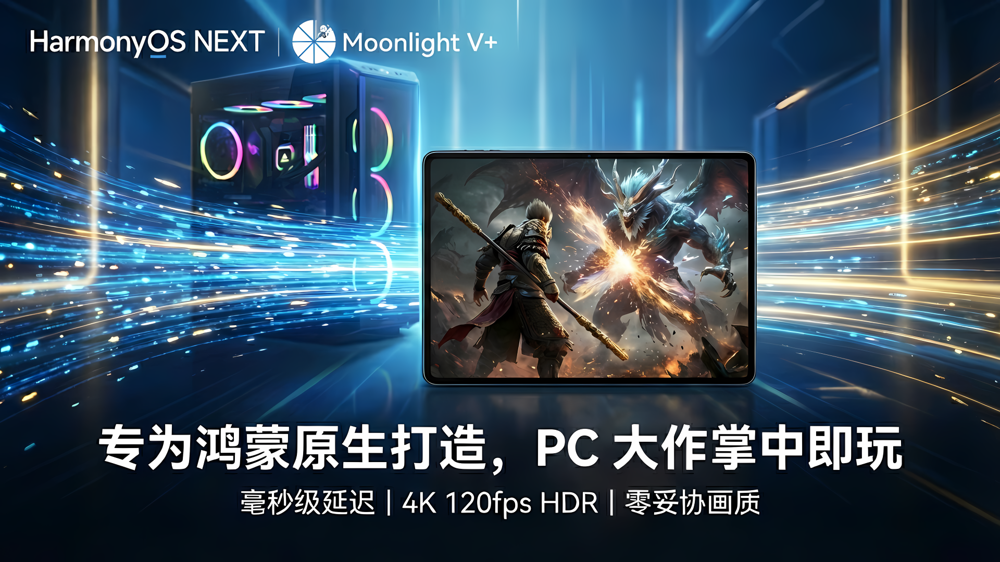
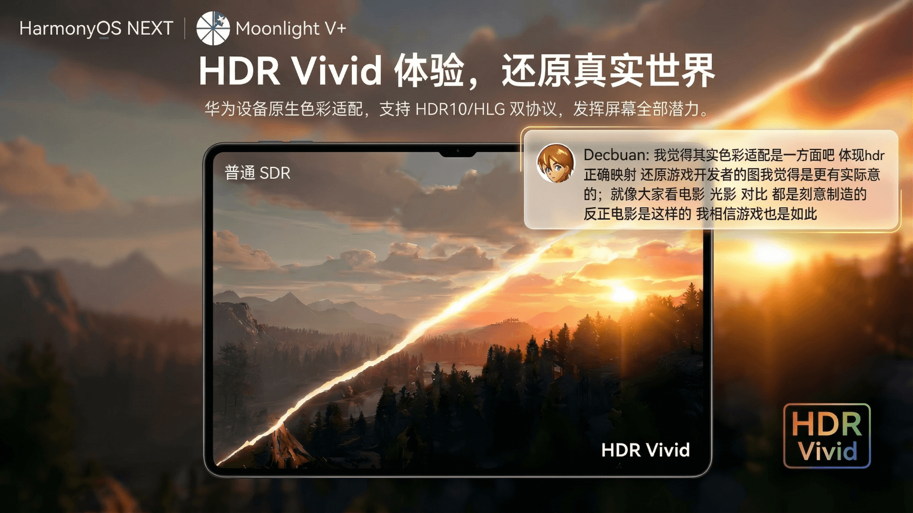
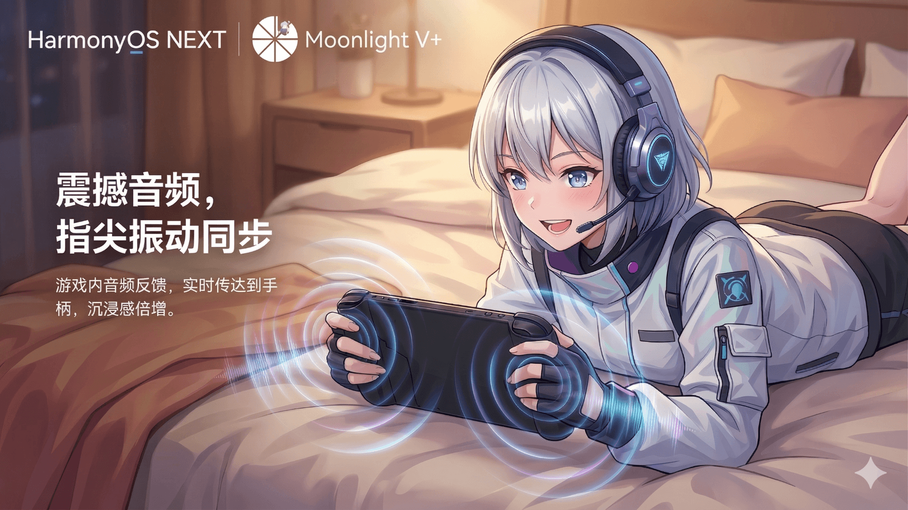
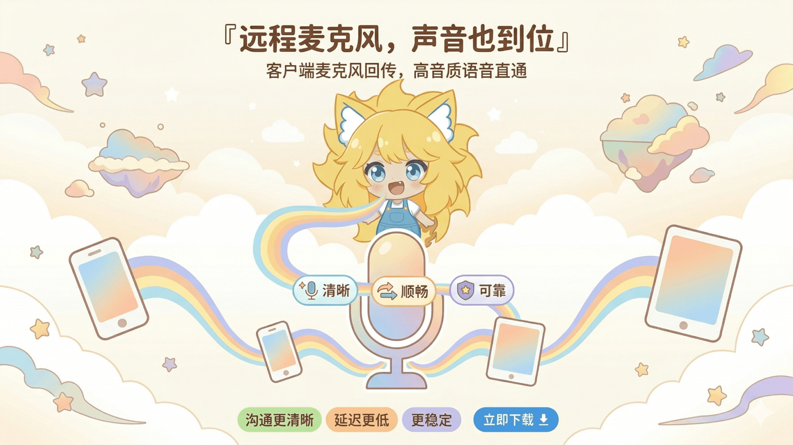

<div align="center">

  

  # Moonlight V+ for HarmonyOS

  **专为鸿蒙打造的 PC 游戏串流客户端**

  [](LICENSE)
  [](https://www.harmonyos.com/)
  [](https://developer.huawei.com/)

  基于 [Moonlight V+](https://github.com/qiin2333/moonlight-vplus) 的鸿蒙原生移植版本

  [功能特性](#功能特性) • [下载安装](#下载安装) • [使用说明](#使用说明) • [相关项目](#相关项目) • [开发指南](#开发指南)

  <a href="https://appgallery.huawei.com/app/detail?id=com.alkaidlab.sdream">
    
  </a>

</div>

---

## 功能特性

### 与原版 Moonlight 的差异

原版 Moonlight 的 HDR 通路只覆盖 HDR10。本项目额外接入了华为设备的 HDR Vivid 与 HLG (ARIB STD-B67) 传输链路，配合 [Foundation Sunshine](https://github.com/qiin2333/foundation-sunshine) 服务端使用时色彩表现更接近主机端原生输出。

| 特性 | 原版 Moonlight | Moonlight V+ |
|------|:-:|:-:|
| HDR10 | ✅ | ✅ 亮度映射同步 |
| HLG / HDR Vivid | ❌ | ✅ |
| 虚拟显示器 | ❌ | ✅ 无缝连接，自由排列 |
| 服务端指令 | ❌ | ✅ 串流中直接执行 |
| 智能码率 (ABR) | ❌ | ✅ 服务端决策，客户端 PID 回退 |
| 超分与锐化 | ❌ | ✅ XEngine / FSR 1 |
| 空间音频 | ❌ | ✅ HarmonyOS 5.0+ |
| 体感助手 (Gyro Aim) | ❌ | ✅ 陀螺仪 → 右摇杆辅助瞄准 |
| Game Controller Kit | ❌ | ✅ 鸿蒙原生手柄 API |
| 音频振动反馈 | ❌ | ✅ 从游戏音频实时提取触感 |
| 剪贴板同步 | ❌ | ✅ 与主机双向同步 |
| 性能覆盖层 | 基础 | ✅ 可拖可锁 / 自定义项目 |
| 麦克风重定向 | ❌ | ✅ 语音开黑 |

### HDR Vivid 全链路

HDR Vivid (CUVA) 的元数据藏在码流里：HEVC 走 SEI，AV1 走 Metadata OBU。要让它真正生效，从服务端到屏幕的每一环都不能丢信息，所以这条链路是分几步打通的：

- **码流识别**：解码前扫描 SEI / OBU，按实际码流判断是不是 HDR Vivid，而不是依赖服务端声明的静态标志，切换片源或中途改配置都能跟上
- **元数据透传**：把扫描到的 CUVA 元数据交给 AVCodec，同时把色域、传输特性、矩阵系数配置到解码器上，避免解码器按默认 BT.709 处理 BT.2020 内容
- **黑位精度**：渲染端保留客户端黑位，不做多余的 limited/full range 转换，暗部细节不会被压平
- **显示输出**：按识别结果设置 NativeWindow 色彩空间（HLG / PQ / SDR→HDR）
- **可观测**：性能覆盖层直接显示当前帧是否走了 HDR Vivid 通路，方便确认而不用猜

整条链路自动工作，不需要在设置里手动指定 HDR 格式。

### 音频驱动振动反馈

不依赖游戏本身的振动脚本，直接从串流音频里实时分析低频能量和节拍，转成手上的触感：爆炸是沉闷的长震颤，鼓点是清晰的短脉冲。

算法部分抽成了独立的 [Moonlight Audio Haptics SDK](audio-haptics-sdk/)（含算法溯源说明与测试），应用侧只负责接入。串流中可以直接在菜单里调强度和开关，也能选择振动跟随哪一路音频输出。实现细节见 [docs/AUDIO_HAPTICS_SDK_HARMONYOS.md](docs/AUDIO_HAPTICS_SDK_HARMONYOS.md)，原理科普见 [docs/AUDIO_HAPTICS_DEEP_DIVE.md](docs/AUDIO_HAPTICS_DEEP_DIVE.md)。

### 视频

- H.264 / HEVC 硬件解码，AV1 在支持的设备与系统上自动启用
- 最高 4K 分辨率，可选 60 / 120 / 144 FPS
- HDR10、HLG、HDR Vivid
- VRR 可变刷新率
- 帧同步：呈现时钟与主机对齐，消除高刷新率下的周期性顿挫（详见 [docs/VIDEO_DECODE_RENDER_ARCHITECTURE.md](docs/VIDEO_DECODE_RENDER_ARCHITECTURE.md)）
- 超分辨率与锐化：优先走华为 XEngine，不可用时回退到 FSR 1（详见 [docs/UPSCALE_PIPELINE_NOTES.md](docs/UPSCALE_PIPELINE_NOTES.md)）

### 音频

- 立体声 / 5.1 / 7.1 环绕声
- 空间音频 (HarmonyOS 5.0+)
- 音频驱动的振动反馈（见上文）
- 麦克风重定向（开发者模式）

### 输入控制

- 蓝牙 / USB 手柄，覆盖 Xbox、DualSense、DualShock 4、Switch Pro 以及通用 HID 设备
- 基于 USB DDK 的直连驱动，绕开系统映射直接读取原始报文
- 虚拟屏幕控制器、触控与鼠标模拟、完整键盘
- 自定义按键面板，支持导入导出与二维码分享
- 全屏串流时锁定鼠标指针，低延迟触控可单独开关
- 手柄振动强度可调，三指手势唤起输入法（可关闭）

### 连接

- 自动发现局域网主机，支持 Wake-on-LAN 唤醒
- 远程串流（需端口转发或公网 IP）
- AES-128 加密连接
- 内置主机 Web UI 入口，可直接管理 Sunshine 配置

## 下载安装

### 系统要求

- HarmonyOS NEXT 5.0 或更高版本
- 支持的设备：华为手机 / 平板 / MatePad

### 安装方式

**鸿蒙应用商店（推荐）**

1. 在华为/鸿蒙设备上打开「应用市场」
2. 搜索 `Moonlight V+`
3. 进入应用详情页后点击安装

也可以先在浏览器打开[应用市场详情页](https://appgallery.huawei.com/app/detail?id=com.alkaidlab.sdream)。若未能自动唤起应用市场，请复制链接到华为浏览器打开，或回到应用市场内搜索应用名。

请优先通过鸿蒙应用商店下载，不建议从非官方网盘或镜像站安装。

**从源码编译**

```bash
git clone https://github.com/AlkaidLab/moonlight-harmony.git
cd moonlight-harmony
# 使用 DevEco Studio 打开并编译，详见「开发指南」
```

<p align="center">
  <a href="https://appgallery.huawei.com/app/detail?id=com.alkaidlab.sdream">
    
  </a>
  <a href="https://appgallery.huawei.com/app/detail?id=com.alkaidlab.sdream">
    
  </a>
  <a href="https://appgallery.huawei.com/app/detail?id=com.alkaidlab.sdream">
    
  </a>
</p>

## 使用说明

### 主机设置

1. 在 PC 上安装 [Foundation Sunshine](https://github.com/qiin2333/foundation-sunshine) 或 NVIDIA GeForce Experience
2. 启用游戏串流功能
3. 确保 PC 和手机在同一局域网

HLG / HDR Vivid、虚拟显示器、服务端指令等特性依赖 Foundation Sunshine，使用官方 Sunshine 或 GFE 时会自动降级为标准行为。

### 配对连接

1. 打开 Moonlight V+ 应用
2. 应用会自动发现局域网内的主机
3. 点击主机进行配对（首次需要在 PC 端确认）
4. 配对成功后即可选择游戏开始串流

### 推荐设置

| 网络环境 | 分辨率 | 帧率 | 码率 |
|----------|--------|------|------|
| 5GHz WiFi 局域网 | 1080p | 60fps | 20 Mbps |
| 5GHz WiFi 局域网 | 4K | 60fps | 50 Mbps |
| 有线 / Wi-Fi 6 | 1080p | 120fps | 40 Mbps |

### 开发者模式

麦克风重定向、PTS 呈现调度等实验性开关默认隐藏。在设置页完成 GitHub Star 验证后即可解锁，验证只读取 Star 状态，不会写入你的仓库。

## 相关项目

| 项目 | 说明 |
|------|------|
| [Moonlight V+ Android](https://github.com/qiin2333/moonlight-vplus) | Android 增强版客户端 |
| [Foundation Sunshine](https://github.com/qiin2333/foundation-sunshine) | 游戏串流服务端 |
| [Moonlight](https://moonlight-stream.org/) | 官方 Moonlight 项目 |
| [moonlight-common-c](https://github.com/moonlight-stream/moonlight-common-c) | 核心协议库 |

## 开发指南

### 开发环境

- **DevEco Studio**：6.1 或更高版本；已验证 HarmonyOS 26.0.0 Beta1 SDK 可进入编译流程
- **HarmonyOS SDK**：兼容 API 12+；当前 targetSdkVersion 保持 6.1.1(24)
- **Node.js**：20.x 或更高版本
- **JDK/JBR**：本地打包 HAP 需要可用的 Java Runtime，可直接使用 DevEco Studio 自带 JBR

暂不把 targetSdkVersion 升到 API 26：API 26 会启用新的 ArkUI / 权限 / 系统行为门控，当前优先保持运行行为稳定，同时让 CI 和本地 SDK 工具链先识别 HarmonyOS 26.0.0。

### 项目结构

```
moonlight-harmony/
├── entry/                          # 主入口模块
│   └── src/main/
│       ├── ets/                    # ArkTS 代码
│       │   ├── pages/              # UI 页面
│       │   ├── components/         # UI 组件
│       │   ├── service/            # 业务服务（串流、网络、输入、剪贴板、USB 驱动）
│       │   └── model/              # 数据模型
│       └── resources/              # 模块资源
├── nativelib/                      # Native 模块
│   └── src/main/cpp/               # C/C++ 代码
│       ├── moonlight_bridge.*      # NAPI 桥接层
│       ├── video_decoder.*         # 视频解码 (AVCodec)
│       ├── gl_post_processor.*     # 后处理与超分 (XEngine / FSR)
│       ├── audio_renderer.*        # 音频播放 (OHAudio)
│       ├── audio_haptics_engine.*  # 音频驱动振动
│       └── moonlight-common-c/     # 核心协议库
├── docs/                           # 架构与调试笔记
└── AppScope/                       # 应用配置
```

### 核心技术

| 功能 | 技术方案 |
|------|----------|
| UI 框架 | ArkUI (ArkTS) |
| 视频解码 | HarmonyOS AVCodec API |
| 画面后处理 | OpenGL ES + XEngine / FSR 1 |
| 音频播放 | OHAudio (低延迟模式) |
| 手柄接入 | Game Controller Kit + USB DDK |
| 网络协议 | moonlight-common-c |
| Native 接口 | NAPI (C++) |

`docs/` 下有各子系统的实现笔记，改动解码渲染、触控、振动或剪贴板前建议先读对应文档。

### 构建项目

```bash
# 克隆仓库
git clone https://github.com/AlkaidLab/moonlight-harmony.git

# 使用 DevEco Studio 打开项目
# File → Open → 选择项目目录

# 命令行构建前安装项目依赖（DevEco Studio 可自动完成）
ohpm install --all

# 运行仓库检查（脚本语法 + Git 忽略规则 + Sunshine 协议模型测试）
npm run check

# 编译调试版应用（与 CI 使用相同的任务）
node hvigorw.js assembleApp --mode project -p product=default -p buildMode=debug --no-daemon
```

## 问题反馈

先在 [Issues](https://github.com/AlkaidLab/moonlight-harmony/issues) 里搜一下有没有相同的问题，没有的话[新建一个](https://github.com/AlkaidLab/moonlight-harmony/issues/new)，并附上：

- 设备型号和系统版本
- 问题复现步骤
- 错误日志（如有）

## 许可证

本项目基于 [GPL v3](LICENSE) 许可证开源。

### 第三方资源声明

本应用的背景壁纸功能使用了第三方 API 服务：

| 来源 | 说明 | 版权 |
|------|------|------|
| [Pipw API](https://img-api.pipw.top) | 二次元壁纸（默认）| 图片版权归原作者所有 |
| [Lorem Picsum](https://picsum.photos) | 摄影壁纸（可选）| Unsplash 授权 |

应用只提供技术链接，不存储也不拥有这些图片的版权；如有版权问题请联系原图片来源方。用户可在设置中随时关闭壁纸功能或切换来源。

## 致谢

- [Moonlight Game Streaming](https://moonlight-stream.org/) - 官方 Moonlight 项目
- [moonlight-common-c](https://github.com/moonlight-stream/moonlight-common-c) - 核心协议库
- [LizardByte/Sunshine](https://github.com/LizardByte/Sunshine) - 开源串流服务端

---

<div align="center">

  **Powered by AlkaidLab**

  觉得有用的话欢迎点个 ⭐️，也可以通过 [GitHub Sponsors](https://github.com/sponsors/AlkaidLab) 赞助我们

</div>
