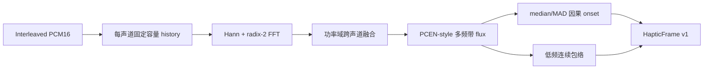

# 音频驱动触觉 P2 因果 DSP 报告

> 状态：P2 完成
> 日期：2026-07-15
> SDK 版本：0.2.0
> ABI 版本：1
> 许可证：Apache License 2.0

## 1. 交付结论

P2 已在不改变公共 ABI v1、也不接管 HarmonyOS 生产振动路径的前提下，完成第一版可运行的跨平台音频触觉 DSP：

- 自研 radix-2 FFT、Hann STFT 和预分配 scratch。
- 每声道独立频谱、功率域融合，避免反相波形抵消。
- 约 5 ms hop、400 ms PCEN-style 自适应、多频带正向 spectral flux。
- 64 帧 median/MAD 鲁棒阈值、120 ms refractory 和纯因果 onset picker。
- 输出瞬态强度、持续时间、锐度、低频比例、声像、置信度和时间戳。
- 低频连续触感使用 attack/release 平滑和变化/停止事件抑制。
- evaluator backend 从 `sdk_core_p1` 升级为稳定的 `sdk_core`。
- SDK 版本由 0.1.0 升至 0.2.0，ABI 仍为 1。

## 2. 实时处理链路



48 kHz 下 hop 为 240 帧（5 ms），FFT 为 1024 点。初始化时一次性分配多声道历史、频谱、PCEN 状态、FFT 实部/虚部和 twiddle 表；`ah_process_i16()` 内不进行 heap allocation，不加锁，不调用日志、回调或平台 API。

多声道输入不先做波形相加。每个声道分别做 FFT，再平均频谱功率，因此左右声道完全反相时仍保留瞬态能量。声像则独立根据左右 hop 能量计算。

## 3. 因果与时间戳

检测器只读取当前和过去的特征帧，不等待未来峰值。事件时间戳使用产生决策的 hop 末端时间：

```text
timestamp = input.first_sample_time_us
          + processed_frames_in_this_call / sample_rate
```

确定性测试中四类瞬态的输出误差中位数均为 +5 ms，即 1 hop；不存在旧 native picker 的 5 帧前视。

## 4. 合成质量结果

命令：

```bash
python tools/audio_haptics_eval/run_baseline.py --runs 30 --warmup-runs 3
```

正向和边界用例：

| 用例 | 标注 | aubio 事件/F1 | native current 事件/F1 | sdk_core 事件/F1 | sdk_core 中位误差 |
|---|---:|---:|---:|---:|---:|
| impulse train mono | 5 | 5 / 1.000 | 2 / 0.571 | 5 / 1.000 | 5 ms |
| kick train stereo | 6 | 12 / 0.667 | 12 / 0.667 | 6 / 1.000 | 5 ms |
| antiphase impulses stereo | 4 | 0 / 0.000 | 0 / 0.000 | 4 / 1.000 | 5 ms |
| silence then hit mono | 1 | 1 / 1.000 | 1 / 1.000 | 1 / 1.000 | 5 ms |

负向用例：

| 用例 | aubio 误事件 | native current 误事件 | sdk_core 误事件 |
|---|---:|---:|---:|
| steady 60 Hz tone | 29 | 3 | 0 |
| speech-like mono | 9 | 7 | 0 |

这些数据说明 P2 已满足合成阶段退出条件，但不能代替真实游戏、音乐、语音和压缩伪影数据集上的产品准入。

## 5. Host 性能

30 次 Release benchmark 的 `sdk_core` 每 5 ms 调用 P99：

| 用例 | 通道 | P99 | 实时倍数 |
|---|---:|---:|---:|
| impulse train | 1 | 85.501 us | 74.887x |
| kick train | 2 | 125.501 us | 58.408x |
| antiphase impulses | 2 | 104.102 us | 62.880x |
| silence then hit | 1 | 94.401 us | 69.384x |
| steady tone | 2 | 133.801 us | 61.136x |
| speech-like | 1 | 117.000 us | 57.043x |

最差 P99 为 133.801 us，低于 Host 阶段每 5 ms block 的 500 us 预算。该结果来自 Windows x64 主机，不代表 HarmonyOS/Android 真机性能；P3/P4 仍需采集 ARM P99、音频 underrun 和端到端振动提交延迟。

## 6. 自动化验证

SDK 目前有四项 CTest：

1. C11 API 生命周期、容量和错误码。
2. C++ ABI/layout 固定性。
3. DSP 集成：mono clicks 4/4、antiphase stereo 4/4、稳态音零瞬态、时间误差 0～1 hop、所有 IR 数值范围。
4. Apache-2.0/SPDX 与 aubio/GPL 边界扫描。

算法来源和 clean-room 边界记录在独立仓库的
[`ALGORITHM_PROVENANCE.md`](https://github.com/AlkaidLab/moonlight-audio-haptics/blob/v0.5.14/ALGORITHM_PROVENANCE.md)；SDK 无第三方 DSP runtime 源码或二进制依赖。

HarmonyOS `nativelib` 也已完成 Debug HAR 回归，arm64-v8a 与 x86_64 均成功编译。P2 静态库分别为 630,818 bytes 和 614,858 bytes，`nativelib.har` 为 12,377,548 bytes。生产代码尚未引用 Core 符号，链接器仍可移除未使用对象；这些大小不能直接当作最终包增量。

## 7. 当前限制

- 0.82 的默认触觉瞬态输出门槛只经过确定性夹具调优；真实内容需要按 precision/recall 和主观触感重新标定。
- 连续低频映射已输出稳定 IR，但尚未做不同设备振动能力曲线和主观 A/B。
- `AH_SCENE_AUTO` 在 P2 暂时退化为 GAME，不包含场景分类器。
- 暂未验证 PCM 时间戳跳变、超长流、1～8 通道全部组合和 fuzz 输入。
- CNN 仍不进入实时 DSP；只有在 P3 证明规则基线的场景误判是主要瓶颈时再立项。

## 8. 下一阶段：P3

P3 建议保持生产输出不变，先做双路 shadow A/B：

1. 收集有授权的真实游戏/音乐/语音片段及事件标注。
2. 在相同 PCM 上并行记录 aubio/current 与 `sdk_core`，不重复 FFT 特征计算到生产路径。
3. 固化漏检、误检、重复触发、时间误差、强度误差和 CPU P99 报表。
4. 为 sensitivity、连续映射和场景 preset 建立版本化参数集。
5. 达到删除指标后，P4 再把 HarmonyOS Renderer 接到 Haptic IR，并保留回滚开关。

结论：P2 技术退出条件已满足，可以进入 P3 真实数据双路验证；目前不建议直接替换线上 aubio/现有振动输出。
