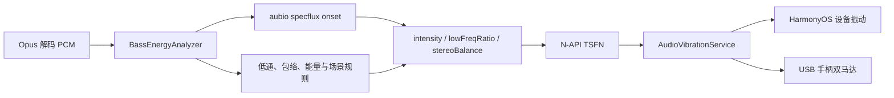
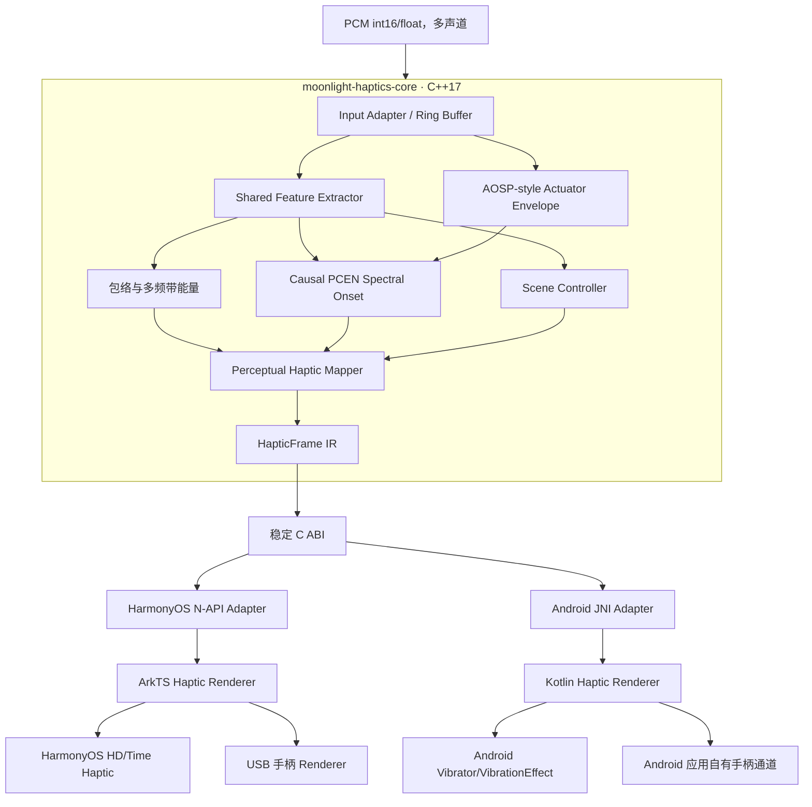
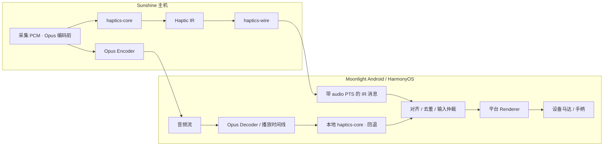

# 音频驱动触觉 SDK 整体实施方案

> 状态：实施中
> 适用范围：Sunshine 服务端、Moonlight HarmonyOS/Android 客户端、独立 Audio-to-Haptics SDK
> 核心决策：采用“**Sunshine 编码前 PCM 检测 + Haptic IR 传输 + 客户端渲染 + 客户端本地检测回退**”的混合架构；服务端与客户端复用同一 C++17 Core，不复制算法；CNN 仅作为后续可选语义控制器。
> 当前实施优先级：**先在 Android 真机完成本地闭环，再启动 Sunshine/Wire 实现**。Android 闭环未达到功能、生命周期、性能和回滚 gate 前，不并行扩展服务端协议。
> 许可证决策：独立 SDK 采用 **Apache License 2.0**（2026-07-15 确认）；现有 GPLv3 应用代码不进入 Apache-2.0 SDK 边界。
> 独立仓库：SDK 已于 2026-07-17 迁移至 [AlkaidLab/moonlight-audio-haptics](https://github.com/AlkaidLab/moonlight-audio-haptics)，发布基线为 [`v0.5.14`](https://github.com/AlkaidLab/moonlight-audio-haptics/releases/tag/v0.5.14)，宿主按不可变 commit SHA 获取源码，不再从 Harmony 仓库内嵌目录消费。
> 实施进度：**P0、P1、P2 已完成；P3 离线、HarmonyOS 设备侧 shadow 与 Android 真机串流 shadow 链路已跑通；P4-A 已将 `AhEngine`、native SPSC IR 队列、批量 JNI drain 和 capability-aware Renderer 收入 Apache-2.0 AAR。`0.5.6 / latency-alignment v2` 已在魅族 17 与 OPPO PKJ110 验证真实串流音乐的播放时钟对齐。`0.5.14 / action-rpg-p4g-v4` 已把 GAME 默认路径切换为面向《原神》一类 BGM-heavy action RPG 的因果 profile：使用项目自研的 trailing-median HPSS 近似、SuperFlux 振音抑制、稳定节拍降权、冲击/锐攻击分层和受限 continuous；不复现旧 BassEnergy，也不修改已确认的 MUSIC 路径。Host 8/8 回归通过，下一步安装 Android 真机，用当前游戏 BGM 验证配乐负载，再在可进入 gameplay 时补战斗召回矩阵。SDK Renderer 生命周期矩阵已完成设置、后台、退出、断流 stop 和手动新会话恢复；客户端自动重连仍属连接层待办，30 分钟长稳按本轮决策后置**（2026-07-16）。结果见 [P0 基线报告](./AUDIO_HAPTICS_P0_BASELINE.md)、[P1 SDK 基础报告](./AUDIO_HAPTICS_P1_SDK_FOUNDATION.md)、[P2 因果 DSP 报告](./AUDIO_HAPTICS_P2_CAUSAL_DSP.md)、[P3 Shadow 基础报告](./AUDIO_HAPTICS_P3_SHADOW_FOUNDATION.md)、[P3 设备侧 Shadow 报告](./AUDIO_HAPTICS_P3_DEVICE_SHADOW.md)和 [Android 真机 Benchmark](./AUDIO_HAPTICS_ANDROID_DEVICE_BENCHMARK.md)。

## 1. 结论与实施边界

本项目采用以下整体方案：

1. 将当前 `BassEnergyAnalyzer` 拆分为“平台无关分析核心”和“平台触觉渲染器”。
2. 使用混合因果 DSP 替代 aubio `specflux`：项目自研的多频带 PCEN/Spectral Flux 负责谱域瞬态，Apache-2.0 AOSP HapticGenerator 风格执行器包络负责压缩音乐中的可触觉攻击。
3. 核心不直接输出 HarmonyOS 的频率、Android 的 `VibrationEffect` 或手柄马达值，而是输出稳定的 `HapticFrame` 中间表示（Haptic IR）。
4. HarmonyOS 通过 N-API 适配器和 ArkTS Renderer 消费 IR；Android 通过 JNI/AAR 和 Kotlin Renderer 消费相同 IR。
5. 采用 aubio/native 双路影子运行、离线标注集和真机指标完成替换，不做一次性切换。
6. 第一阶段不引入 CNN。算法稳定、SDK 跑通后，再评估 tiny causal CNN 是否能改善场景识别和参数控制。
7. Sunshine 在 Opus 编码前的原始 PCM 上运行同一 Core，并通过专用、带音频时间戳的 Haptic Wire 发送 IR；不传原始 PCM 或中间音频特征。
8. 客户端 Renderer 始终保留在终端侧；服务端 IR 可用时作为权威输入，旧版 Sunshine、协商失败或 IR 超时/丢失时自动切换到解码后 PCM 的本地 Core。
9. 任一时刻只能由“服务端 IR”或“本地回退 IR”中的一路驱动 Renderer，禁止双路叠加触发。
10. 实施顺序以 Android 本地闭环为先：先证明同一 SDK IR 能稳定驱动真实马达并可靠 stop/回滚，再把已验证的 Core/IR 接到 Sunshine；服务端方案不作为 Android 闭环的依赖。

非目标：

- 不承诺从混合音频中精确识别“枪声、爆炸、脚步”等具体游戏事件。
- 不在 DSP 核心中调用系统振动 API、N-API、JNI 或日志 API。
- 不让 CNN 直接逐采样生成马达波形。
- 不追求逐项复刻 aubio 内部实现；产品体验、时延和误触发指标优先。
- 不把平台马达波形、Android primitive 或 HarmonyOS 效果 ID 放进服务端协议。
- 不复用现有 gamepad rumble 消息承载音频触觉；Haptic IR 使用独立能力标识和消息语义。

## 2. 当前基线

### 2.1 当前链路



| 组件 | 当前职责 | 主要问题 |
|---|---|---|
| `bass_energy_analyzer.h` | 低频能量、包络、场景模式、onset 后处理 | DSP、策略和输出协议耦合在单个类中 |
| `aubio_onset_wrapper.h` | 使用 aubio `specflux` | 为单一 onset 功能引入较大的 GPL 依赖子集 |
| `spectral_onset_detector.h` | 自研 STFT、白化、频谱通量和峰值检测 | 尚未接入；存在 5 帧前视和边界问题 |
| `callbacks.cpp` | 解码线程分析并通过 TSFN 回调 ArkTS | 每次事件动态分配；协议只有三个整数 |
| `AudioVibrationService.ets` | 防抖、设备能力判断、设备与手柄路由 | 同时承担产品策略与 HarmonyOS API 细节，不可直接移植 Android |

### 2.2 必须解决的问题

- 当前自研 detector 使用 5 个未来 hop 确认局部峰值；在 48 kHz、240 samples/hop 下增加约 25 ms 算法前视。
- 多声道先求和再分析会使反相左右声道发生抵消。
- 自研 detector 的静音分支和正常分支保存了不同特征域的历史频谱。
- `hopSize` 与最大 FFT 缓冲区之间缺少完整的输入校验。
- 当前三个整数不足以同时表达持续震感、瞬态冲击、材质锐度、空间位置和置信度。
- HarmonyOS 层频繁 stop/start 振动可能造成触感断续、API 压力和额外延迟。

## 3. 目标架构



### 3.1 分层原则

- **Core 只理解声音和感知参数**：不包含平台头文件，不知道系统振动 API。
- **IR 表达意图，不表达设备实现**：使用 `sharpness` 而不是硬编码 45 Hz，使用 `transientAmplitude` 而不是直接输出右马达数值。
- **Renderer 负责能力降级**：宽频马达、幅度可控马达和只有开关能力的马达使用不同映射。
- **实时线程只做有界工作**：初始化后不分配内存、不加锁、不阻塞、不写日志、不执行平台回调。
- **算法和平台可分别演进**：更换 onset 或增加 CNN 不改变 C ABI；平台 API 变化不影响 DSP。

### 3.2 Sunshine 混合架构与职责拆分



推荐拆分如下：

| 模块 | 部署位置 | 职责 | 不负责 |
|---|---|---|---|
| `haptics-core` | Sunshine 与客户端共用 | PCM → 特征/事件 → Haptic IR | 网络、平台 API、日志上报 |
| `haptics-wire` | 服务端与客户端共用 | IR 序列化、版本协商、时间戳、去重/乱序规则 | 音频分析、设备映射 |
| `haptics-sunshine-adapter` | Sunshine | 从 Opus 编码前 PCM 喂入 Core，按会话发送 IR | 生成具体设备波形 |
| `haptics-local-fallback` | Moonlight 客户端 | 用解码后 PCM 调用同一 Core；在服务端 IR 不可用时接管 | 与服务端 IR 同时驱动 |
| `haptics-renderer-android` | Android 客户端 | IR → `VibrationEffect`/composition/降级脉冲 | PCM 分析、网络协议 |
| `haptics-renderer-harmony` | HarmonyOS 客户端 | IR → HD/Time Haptic/USB 手柄 | PCM 分析、网络协议 |

Sunshine 当前音频链路在采集 PCM 后进入 Opus 编码线程，因此服务端检测应挂在编码前的 PCM 分支，不能从压缩码流恢复特征；以 Sunshine 当前实现为准，入口需在集成阶段再次核对 [Sunshine `audio.cpp` 文档](https://docs.lizardbyte.dev/projects/sunshine/master/audio_8cpp.html?lng=en-US)。现有 Sunshine 通用反馈结构主要表达手柄 rumble 等设备反馈，不具备音频时间线、感知参数与版本协商语义，不能直接替代 Haptic Wire，参见 [Sunshine `common.h` 源码文档](https://docs.lizardbyte.dev/projects/sunshine/master/common_8h_source.html)。

客户端会话采用三个互斥状态：

1. `SERVER_IR`：能力协商成功，服务端 IR 连续且时间戳有效；只消费服务端 IR。
2. `LOCAL_FALLBACK`：服务端不支持、协商失败或 IR 超时；只消费本地 Core 输出。
3. `OFF`：用户关闭、应用失焦、会话结束或平台无可用振动能力；立即提交 stop 并清空两路状态。

状态切换必须在音频时间线上完成去重和短窗口抑制，避免同一 onset 在切换边界被触发两次。

当前迭代只实现客户端图中的 `Opus Decoder → 本地 haptics-core → Android Renderer → 手机马达`。`haptics-wire`、Sunshine Adapter 和 `SERVER_IR` 状态保留接口设计，但冻结实现，直到 Android 本地闭环通过第 10.2 节 gate。

### 3.3 SDK 与客户端边界审计（2026-07-16）

这里的“SDK”包含平台无关 Core 与平台 Renderer；“客户端”指 Moonlight Android/HarmonyOS
宿主应用。最终边界按“触觉意图是否跨设备成立”判断，而不是按当前代码所在目录判断：

| 层 | 应拥有 | 不应拥有 |
|---|---|---|
| `haptics-core` | PCM 特征、因果 onset、节奏状态、`GAME/MUSIC/AUTO` 场景语义、瞬态/连续包络与设备无关 IR | Android/Harmony API、具体机型增益、网络与 UI |
| 平台 Adapter/Renderer（AAR/Harmony SDK） | 固定队列、播放时钟与 deadline、stale/latest-wins、能力探测、predefined/primitive/envelope/waveform 降级、设备幅度/时长归一化、可靠 stop | 从 PCM 重做场景算法、产品开关、手机/手柄业务路由 |
| Moonlight 客户端 | 接入解码 PCM、选择场景/profile、用户开关与总强度、生命周期、手机/手柄路由、系统 `HapticGenerator` 仲裁、聚合遥测和旧链路回滚 | 通用 groove 曲线、onset 增益、瞬态时长、场景 attack/release 等可移植触觉创作 |

`0.5.14 / action-rpg-p4g-v4` 启用新 GAME 默认接线后，当前实现状态如下：

- `AhEngine`、IR 队列、JNI drain、presentation clock 调度和手机马达能力降级已在 AAR，边界正确。
- 通用 `MUSIC` authoring 已从 Android 宿主迁入 Core 的 `MusicSceneAuthor`：groove
  启停滞回、低频支持门控、瞬态增益、首拍/长间隔 restart 衰减和连续幅度上限均生成
  设备无关 IR；`AH_FRAME_MUSIC_RESTART` 显式携带 restart 意图。
- Android Renderer 的 `HapticDevicePolicy` 根据 amplitude/on-off 与 primitive/envelope
  能力映射音乐瞬态下限和时长。Moonlight `AudioVibrationService` 不再重写通用音乐曲线，
  只应用用户总强度、产品仲裁和手机/手柄路由。
- 独立 `GameSceneAuthor` 在 Core 中默认启用。GAME 消费 HPSS/SuperFlux 衍生的
  percussive/harmonic salience，并把稳定节拍上的中等事件视作 BGM 证据降权；明确的低频物理
  冲击可绕过该惩罚。连续意图需要至少 12 个因果证据 hop、非音调低频支持和迟滞，IR 上限为
  `0.24`，长时间底震由 fatigue 预算压低但不削弱 transient。
- Core 的 `AUTO` 当前直接落到 `GAME`，还没有实现文档第 6.6 节的分类器。
- 旧 `BassEnergy` 保留在 GPL 宿主仅用于关闭 SDK 时回滚，不进入 Apache-2.0 SDK，也不作为
  新算法的第二个并行输出。

`MUSIC` 边界迁移与新 GAME author 均有 Core/Renderer 回归。后续顺序固定为：先用游戏 BGM
验证负载和误触发，再用真实 gameplay 校准战斗召回，之后补 predefined/手柄 Renderer，最后
实现 `AUTO`；厂商连续缩放作为可关闭 device profile 独立推进。每一步保持 IR 单路输出和真机
A/B，不同时重写检测器、Renderer 与客户端接线。

## 4. SDK 目录与构建产物

建议在仓库顶层新增独立目录，避免继续把公共核心埋在 HarmonyOS `nativelib` 内：

```text
audio-haptics-sdk/
├─ CMakeLists.txt
├─ LICENSE                 # Apache License 2.0 英文原文
├─ NOTICE                  # 第三方归属信息；没有适用信息时可不创建
├─ include/
│  └─ moonlight_haptics/
│     ├─ audio_haptics.h   # 稳定 C ABI
│     ├─ haptic_wire.h     # IR wire schema 与编解码 API
│     └─ version.h
├─ src/
│  ├─ core/
│  │  ├─ audio_haptics_engine.cpp
│  │  ├─ feature_extractor.cpp
│  │  ├─ causal_onset_detector.cpp
│  │  ├─ scene_controller.cpp
│  │  └─ haptic_mapper.cpp
│  └─ dsp/
│     ├─ fft.cpp
│     ├─ biquad.cpp
│     ├─ pcen.cpp
│     └─ window.cpp
├─ wire/
│  ├─ haptic_wire_codec.cpp
│  ├─ capability_negotiation.cpp
│  └─ sequence_tracker.cpp
├─ adapters/
│  ├─ sunshine/
│  │  └─ sunshine_haptics_adapter.cpp
│  ├─ harmony/
│  │  ├─ haptics_napi.cpp
│  │  ├─ HapticInputSelector.ets
│  │  └─ HapticRenderer.ets
│  └─ android/
│     ├─ src/main/cpp/haptics_jni.cpp
│     ├─ src/main/java/.../HapticInputSelector.kt
│     └─ src/main/java/.../HapticRenderer.kt
├─ tests/
│  ├─ unit/
│  ├─ golden/
│  └─ fixtures/
├─ benchmarks/
└─ tools/
   └─ evaluator/
```

构建产物：

| 目标 | 产物 | 用途 |
|---|---|---|
| `moonlight_haptics_core` | CMake 静态库 | 被 Sunshine、HarmonyOS `.so` 和 Android JNI `.so` 链接 |
| `moonlight_haptics_wire` | CMake 静态库 | Haptic Wire 编解码、版本与序列处理；服务端和客户端共用 |
| Sunshine Adapter | 宿主集成静态库/源集 | 接入 Sunshine 编码前 PCM 与会话传输层 |
| Harmony Adapter | 当前 `moonlight_nativelib` 的一部分 | 保持现有 N-API 集成方式 |
| Android SDK | AAR，内含 JNI 库与 Kotlin API | Android 应用直接依赖 |
| Host Test | Windows/Linux/macOS 测试程序 | 离线跑 WAV、golden test 和 benchmark |

第一版 Android 产物至少支持 `arm64-v8a`；`x86_64` 用于模拟器和 CI，可作为开发产物。Core 本身不绑定 Android minSdk，minSdk 由 Renderer 使用的 API 和宿主应用决定。

## 5. 公共数据协议

### 5.1 输入约束

- PCM 格式：第一版必须支持 interleaved signed 16-bit；内部统一归一化为 `[-1, 1]`。
- 采样率：优先优化 48 kHz，同时验证 44.1 kHz。
- 声道：1～8 声道；未知布局时至少保留左右主声道并对其余声道做能量融合。
- 输入帧长：允许变化。Core 内部用固定容量 ring buffer 重新切为分析 hop，不能假设 Android 一定是 240 samples。
- 时间戳：宿主可传入首样本单调时钟时间；未提供时由 Core 按已处理样本数推导。

### 5.2 Haptic IR

第一版建议使用以下 ABI 结构；所有归一化值在输出前必须 clamp：

```c
typedef uint32_t AhScene;
enum {
    AH_SCENE_GAME = 0,
    AH_SCENE_MUSIC = 1,
    AH_SCENE_AUTO = 2,
    AH_SCENE_UNKNOWN = 3
};

typedef uint32_t AhFrameFlags;
enum {
    AH_FRAME_NONE = 0,
    AH_FRAME_CONTINUOUS_CHANGED = 1u << 0,
    AH_FRAME_TRANSIENT = 1u << 1,
    AH_FRAME_STOP = 1u << 2,
    AH_FRAME_SCENE_CHANGED = 1u << 3
};

typedef struct AhHapticFrame {
    uint32_t struct_size;
    uint32_t flags;
    uint64_t timestamp_us;

    float continuous_amplitude;  // 0..1，持续冲击/轰鸣底座
    float transient_amplitude;   // 0..1，瞬态敲击强度
    float transient_duration_ms; // 建议时长，由 Renderer 按能力修正
    float sharpness;             // 0..1，沉重 -> 清脆；不是物理频率
    float low_band_ratio;        // 0..1，用于双马达或宽频映射
    float stereo_pan;            // -1..1，左 -> 右
    float confidence;            // 0..1，本帧触觉意图置信度

    uint32_t active_scene;        // AhScene；固定宽度以保持 C ABI 稳定
    uint32_t reserved[8];        // 保证 AhHapticFrame v1 固定为 80 bytes
} AhHapticFrame;
```

设计约束：

- `continuous_amplitude` 和 `transient_amplitude` 必须分开，避免用一个 intensity 同时表达爆炸余震和鼓点。
- `sharpness` 是跨设备感知维度。具体频率或 primitive 由 Renderer 决定。
- `timestamp_us` 表示该触觉意图对应的音频时间，不表示平台 API 实际提交时间。
- `AhHapticFrame` v1 固定为 80 bytes；小版本只能消耗 `reserved`，不得改变已有字段语义或数组步长。需要更大结构时必须新增 API/ABI 版本。
- Core 只在状态有意义地改变、检测到 transient 或需要 stop 时设置 flags，避免每 5 ms 都穿越 N-API/JNI。

### 5.3 Haptic Wire v1

Haptic Wire 是网络传输格式，不直接 `memcpy` C ABI 结构。首版逻辑消息至少包含：

```text
protocol_version
session_id
sequence
audio_pts_us
parameter_set_version
flags
frames[]
```

协议约束：

- 能力名暂定为 `audio-haptics-ir-v1`，必须通过会话能力协商显式启用；未协商时服务端不得发送、客户端不得假定存在。
- `audio_pts_us` 与音频包使用同一媒体时间线；客户端根据实际播放时钟调度，不按网络到达时刻直接振动。
- Wire 只传平台无关 IR，不传 PCM、频谱、mel/PCEN 特征或具体设备波形。
- 每条消息携带 `sequence`；客户端处理去重、有限乱序、过期丢弃与会话重建，旧会话消息不能驱动新会话。
- 优先采用小型、无队头阻塞的消息；关键 transient/stop 可在后续消息中有限冗余。具体复用 GameStream 扩展通道还是新增数据通道，在 Sunshine 原型阶段验证后定稿。
- 客户端持续监测消息新鲜度。超时即切换 `LOCAL_FALLBACK`，恢复时先完成时间戳连续性和去重检查，再切回 `SERVER_IR`。
- `parameter_set_version` 必须随消息或会话配置明确传递，防止同一 IR 字段在服务端与客户端按不同参数含义解释。

### 5.4 C ABI

公共边界使用 C ABI，内部继续使用 C++17：

```c
typedef struct AhEngine AhEngine;

typedef struct AhConfig {
    uint32_t struct_size;
    uint32_t sample_rate;
    uint32_t channel_count;
    uint32_t requested_scene;     // AhScene
    float sensitivity;            // 0.1..3.0
    float output_gain;            // 0..1
    uint32_t feature_flags;
    uint32_t reserved[8];
} AhConfig;

typedef struct AhProcessInput {
    uint32_t struct_size;
    const int16_t* interleaved_pcm;
    uint32_t frame_count;          // 每声道样本数
    uint64_t first_sample_time_us;
} AhProcessInput;

int32_t ah_create(const AhConfig* config, AhEngine** out_engine);
int32_t ah_update_config(AhEngine* engine, const AhConfig* config);
uint32_t ah_get_max_output_frames(const AhEngine* engine,
                                  uint32_t input_frame_count);
int32_t ah_process_i16(AhEngine* engine,
                       const AhProcessInput* input,
                       AhHapticFrame* out_frames,
                       uint32_t out_capacity,
                       uint32_t* out_count);
void ah_reset(AhEngine* engine);
void ah_destroy(AhEngine* engine);
uint32_t ah_get_abi_version(void);
```

返回值需要区分：成功但无输出、产生输出、输出缓冲区不足、非法参数、未初始化和内部错误。一次输入可能跨越多个内部 hop，因此 API 使用调用方提供的固定输出数组，而不能只返回一个事件；输出容量不足时必须在消费 PCM 前返回，异常不得穿越 ABI。

### 5.5 线程模型

- 每个 `AhEngine` 的 `ah_process_i16()` 仅由一个音频解码/采集线程调用；Sunshine 为每个音频会话维护独立 Engine 状态。
- `ah_update_config()` 不直接修改正在处理的状态；使用双缓冲配置快照，在下一个 hop 边界生效。
- `reset/destroy` 由宿主保证不与 `process` 并发。
- 创建阶段允许一次性分配；创建成功后，`process` 路径禁止 heap allocation。
- Core 不主动创建线程。模型推理若后续加入，也必须保持有界、可关闭并明确调度策略。
- Sunshine 音频捕获/编码实时线程只执行有界 Core 调用并写入固定容量队列；序列化与网络发送由非实时发送路径完成。
- 客户端本地 Core 可持续 shadow 运行以缩短接管时间，但在 `SERVER_IR` 状态下其输出只能进入统计/去重缓存，不能进入 Renderer。
- Renderer 调度以音频播放时钟为准；网络线程、解码线程和平台振动 API 线程之间使用固定容量队列，不互相阻塞。

## 6. 核心算法

### 6.1 共享特征提取

默认基线参数：

| 参数 | 初始值 | 说明 |
|---|---:|---|
| Sample rate | 48 kHz | 串流音频主路径 |
| Analysis hop | 240 samples | 5 ms；其他输入帧长由 ring buffer 适配 |
| FFT size | 1024 | 约 21.3 ms 历史窗口，不使用未来样本 |
| Window | Hann | 预计算 |
| 最小 onset 间隔 | 80 ms | 可由 profile 调整 |
| 静音门限 | -70 dBFS 起步 | 最终由数据集校准 |

处理步骤：

1. 校验 PCM 指针、帧长、声道数和采样率。
2. 分声道计算绝对能量/RMS，再进行能量域融合，禁止先相加波形后分析。
3. 低频连续路径保留 biquad、attack/release envelope 和自适应 noise floor。
4. STFT 只计算一次，为 onset、频带能量、场景规则和未来 CNN 共享。
5. 频谱按触觉用途聚合为低频冲击、主体、瞬态攻击和高频纹理等逻辑频带。
6. 对频带或谱 bin 使用 PCEN/自适应归一化，降低音量变化、压缩器和持续背景音的影响。

推荐 PCEN 形式：

```text
M[t] = (1-s) * M[t-1] + s * E[t]
PCEN[t] = (E[t] / (epsilon + M[t])^alpha + delta)^r - delta^r
```

PCEN 参数不作为第一版公共 API 暴露，统一通过 `game/music/auto` profile 管理。

### 6.2 因果 onset 检测

```text
STFT magnitude
  -> PCEN / adaptive whitening
  -> log compression
  -> positive spectral flux
  -> multi-band weighted sum
  -> causal adaptive threshold
  -> refractory / silence gate
  -> transient strength + sharpness
```

峰值检测必须满足：

- 不再等待 5 个未来帧。使用当前 flux 相对前一帧上升、动态阈值、斜率变化或至多 1 hop 延迟完成触发。
- 阈值由过去窗口的 median/EMA/MAD 估计，不能引用未来样本。
- 低频 band 和中高频 band 分别计算 novelty，再根据 profile 加权。
- onset 强度使用“当前 novelty 超过动态阈值的幅度”连续表达，而不是只有 bool。
- 静音结束时重置或平滑恢复历史谱，避免第一下漏检或误触发。

### 6.3 对现有 `SpectralOnsetDetector` 的改造清单

| 编号 | 改造 | 完成标准 |
|---|---|---|
| OSD-01 | 将 `PICKER_WIN_POST=5` 改为因果 picker | 算法前视不超过 1 hop |
| OSD-02 | 分声道 magnitude/energy 融合 | 反相立体声测试不会丢失 onset |
| OSD-03 | 统一 `prevSpectrum` 的特征域 | 静音前后使用相同的白化/压缩状态规则 |
| OSD-04 | 校验 sample rate、channel、hop 和 FFT size | 非法输入返回错误且无越界 |
| OSD-05 | 将局部大数组移入预分配 scratch | 实时路径栈使用可控 |
| OSD-06 | 抽出共享 FFT/特征层 | onset 与场景分类不重复 FFT |
| OSD-07 | 增加 PCEN 或等效自适应归一化 | 音量变化和持续底噪下阈值稳定 |
| OSD-08 | 输出强度、sharpness、confidence | 不再只返回 onset bool |

### 6.4 AOSP 风格执行器包络与混合判定

为改善“开头有一下、后续压缩鼓点漏检”的问题，P4-B 引入第二条完全因果的触觉特征支路。实现依据 Android Open Source Project 的
[HapticGenerator](https://android.googlesource.com/platform/frameworks/av/+/master/media/libeffects/hapticgenerator/)，上游和本项目适配文件均按 Apache License 2.0 保留归属；参数调优遵循 Android 的
[音频耦合触觉设计说明](https://source.android.com/docs/core/interaction/haptics/haptics-ux-foundation)。

```text
每声道 PCM
  -> 50 Hz HPF2 -> 9 kHz LPF2 -> 半波整流
  -> 60 Hz HPF2 -> 700/400/500 Hz LPF2
  -> 执行器谐振 BPF（默认 150 Hz，Q=1）
  -> 5 Hz 慢包络 / partial AGC（指数 -0.8，offset 0.01）
  -> 谐振带阻 -> 三次非线性 -> 300 Hz LPF2 -> soft limiter
  -> 每 5 ms 输出最近 40 ms 因果窗的 tactile RMS / peak / mean-absolute
```

实现约束：

- 每个声道独立运行滤波状态，再使用绝对峰值融合，避免反相立体声抵消。
- 初始化后不分配、不加锁、不调用平台 API；处理只依赖当前和历史样本，没有 look-ahead。
- 40 ms 滚动能量窗覆盖约 6 个默认 150 Hz 谐振周期，抑制 5 ms hop 内的载波相位起伏；它每 5 ms 更新且不等待未来样本。
- AOSP 原效果直接生成 audio-rate haptic channel；SDK 只将其汇总为固定 hop 的执行器特征，并与谱域候选做 OR/fusion，公共 `AhHapticFrame` ABI 不变。
- 普通灵敏度仍要求较强的执行器攻击；音乐灵敏度降低 tactile peak/rise/slope 门槛并缩短 refractory，以召回经压缩的连续鼓点。
- 稳态低频不能仅凭电平持续产生 transient；候选必须同时满足相对慢包络的 rise 与相邻 hop slope，现有持续 60 Hz 负例继续作为 gate。
- 实现来源、改动范围和许可证记录在 SDK 的 `ALGORITHM_PROVENANCE.md` 与 `THIRD_PARTY_NOTICES.md`，不链接或分发 AOSP 运行时二进制。

### 6.5 连续触觉路径

连续路径负责爆炸尾部、引擎、撞击和低频轰鸣：

- 20～80 Hz 低频能量作为基础，但不直接线性映射到振动强度。
- 结合全频 RMS、noise floor、attack/release 和短长时能量比抑制环境底噪。
- 使用 soft-knee/gamma 曲线，低于感知阈值保持为零，强冲击保留动态范围。
- 释放时间由场景控制：游戏冲击可稍长，音乐节拍应短。
- `AH_FRAME_STOP` 必须可靠发出，避免平台维持残留振动。

### 6.6 场景控制

第一版保留 `GAME/MUSIC/AUTO`：

- `GAME`：低频连续路径权重高，允许强冲击自然衰减。
- `MUSIC`：onset/transient 权重高，持续底座弱，强调节奏而不持续嗡鸣。
- `AUTO`：使用 transient density、onset interval 稳定性、低频占比和谱平坦度做低频率决策；必须有滞回和最短驻留时间。

自动模式的切换周期建议为 1～3 秒，连续两次同方向判定才切换。场景控制不应阻塞每个瞬态的低延迟检测。

### 6.7 CNN 的位置

CNN 作为后续可选模块，仅用于输出低频更新的控制量。混合架构下优先部署在 Sunshine，因为主机通常有更稳定的算力且可避免移动端重复推理；客户端 tiny CNN 只作为可编译关闭的本地回退增强：

```text
log-mel/PCEN patch -> tiny causal CNN -> scene probabilities / material hint
```

约束：

- 每 20～50 ms 推理一次，而不是每 5 ms hop 推理。
- 参数量目标小于 100k，INT8 优先，模型及 runtime 可编译关闭。
- CNN 只调节 profile、sharpness 或 confidence；瞬态时序仍由因果 DSP 决定。
- 模型关闭、加载失败或设备性能不足时，DSP 结果必须完整可用。
- 服务端模型输出仍转换为同一 Haptic IR；Wire 不暴露模型 tensor，消息携带可审计的 `parameter_set_version`。
- 客户端与服务端模型版本不要求相同，但同一会话只能选择一路 IR；客户端不得把本地 CNN 结果叠加到服务端 IR。

### 6.8 `GAME` 场景（0.5.12 首轮已实现）

混合游戏音频只能提供“此刻声音具有冲击/持续低频/锐利攻击”等证据，不能可靠判断它是
玩家枪声、远处爆炸、配乐还是语音。第一版 `GAME` 因此仍是低延迟 audio-to-haptics，
不伪装成游戏事件 API；游戏遥测或 Sunshine 显式事件可在后续作为更高权重的独立输入。

Core 的 `GAME` profile 按以下顺序实现：

1. **关闭节奏预测补拍**：只允许当前 PCM 的因果证据产生瞬态，避免把背景音乐节拍扩写成
   游戏反馈；共享 onset detector 继续使用，但不使用 PLP 的 predicted beat。
2. **分离“重冲击”和“锐攻击”意图**：低频占比、短长时能量比和执行器包络共同形成
   impact score；谱通量和 sharpness 形成 click score。两者仍写入现有
   `transientAmplitude/sharpness/lowBandRatio`，首轮不扩 C ABI。
3. **重写持续路径**：引擎/载具/轰鸣要求低频能量持续若干 hop 才启动，使用快速 attack、
   可控 release 和迟滞；短爆炸尾部可自然衰减，但语音、宽带风噪和配乐不能仅凭 RMS 长时间
   保持底座。
4. **增加疲劳与误触发控制**：自适应 noise floor、连续 duty-cycle 预算和强事件后的短恢复窗
   共同抑制常驻震动；上限只作用于 continuous，不削掉明确 transient。
5. **保留设备无关 IR**：Core 不选择 `THUD/CLICK`，也不写具体频率。Android Renderer 根据
   `sharpness/lowBandRatio/confidence` 与设备能力选择 predefined、primitive、envelope 或
   amplitude waveform；手柄 Renderer 独立映射低/高频马达和左右声像。

`0.5.12 / scene-core-p4g-v2` 已完成上述 Core 首轮并保持 ABI v1 的 80-byte frame 不变。
自动回归覆盖低频持续准入、宽带噪声拒绝、release/stop tail、长时间 continuous duck、
疲劳不削弱 transient、impact/click 层次，以及 GAME IR 不带 MUSIC restart/predicted flag。
当前尚未宣称体验 gate 通过；仍需用真实游戏完成下述手机矩阵，再决定参数和 predefined 分支。

`0.5.13 / game-legacy-p4g-v3` 按体验决策暂不让该实验 author 驱动默认 GAME IR，恢复改造前的
共享 continuous + 因果 onset 风格；MUSIC、Android Renderer 和 ABI 不变。公共 IR 回归额外
要求持续 60 Hz 输入能超过实验 profile 的 `0.55` 上限，以防默认路径被无意切回。待可进入
实际 gameplay 后，再以单项开关方式重新评估准入、impact/click 和 fatigue，而不是整包切换。

`0.5.14 / action-rpg-p4g-v4` 不再复现旧 BassEnergy，改为针对《原神》一类配乐占比较高、
战斗事件稀疏但需要层次的 action RPG profile：

1. `FeatureExtractor` 保留 MUSIC 的原始 PCEN flux，同时新增 trailing 9-frame 时间中值、
   current-frame 7-bin 频率中值和 soft mask，作为 Fitzgerald median-filter HPSS 的无前视近似；
2. 当前 PCEN 谱与上一帧 5-bin frequency maximum 比较，按 SuperFlux 思路抑制弦乐、人声振音
   引起的伪 onset，再用 percussive mask 得到 GAME 专用 novelty；
3. `GameSceneAuthor` 只接受足够打击性/惊奇度的瞬态；现有因果 PLP 已锁定且事件稳定踩拍时，
   对中等事件降权，强低频物理冲击绕过该惩罚；GAME 仍不使用 predicted beat 补拍；
4. 重冲击输出更长、更钝的 transient，锐攻击输出更短、更利落的 transient；稳定管弦、人声
   和纯音底座被拒绝；
5. continuous 只接受持续的非音调低频轰鸣，累计至少 12 个证据 hop，IR 上限从旧式 full-scale
   路径收紧到 `0.24`，4-hop 释放迟滞与 fatigue 预算避免频繁启停和长震疲劳；
6. 算法只使用当前/历史帧，固定缓冲在 `ah_create()` 分配，不复制论文或外部实现，不引入模型、
   runtime 或新的第三方二进制依赖。

论文依据为 Fitzgerald 的
[Harmonic/Percussive Separation using Median Filtering](https://www.dafx.de/paper-archive/details/DsmIVcydPX66AuaqEmKyTQ)
与 Böck/Widmer 的
[Maximum Filter Vibrato Suppression for Onset Detection](https://www.dafx.de/paper-archive/details.php?id=0oee-99Z88WL7pSo749gcA)。
实现与许可边界详见 SDK 的 `ALGORITHM_PROVENANCE.md` 和 `THIRD_PARTY_NOTICES.md`。

首轮 A/B 固定覆盖：爆炸、枪声、碰撞、受击、脚步、UI click、引擎/载具、持续风噪、
对白、带配乐战斗、纯过场音乐和安静场景。除主观同步/力度/协调感外，记录关键瞬态 recall、
语音/音乐误触发率、continuous duty cycle、stop tail、audio-target skew，并分别在手机马达和
手柄上验收。CNN 若进入后续，只能每 20～50 ms 提供 scene/material hint；瞬态时序继续由
因果 DSP 决定。

## 7. 平台 Renderer

### 7.1 HarmonyOS

迁移后的数据流：

```text
ah_process_i16
  -> 固定容量 SPSC event queue
  -> 单次非阻塞 TSFN 唤醒
  -> ArkTS 批量 drain HapticFrame
  -> HarmonyHapticRenderer
```

实施要求：

- 用固定容量 SPSC queue 替代每次 callback `new CallbackData`；队列满时合并连续状态，优先保留 transient 和 stop。
- TSFN 只负责唤醒 ArkTS，不为每个 5 ms hop 创建 JS 调用。
- `AudioVibrationService` 拆为通用路由策略和 `HarmonyDeviceHapticRenderer`。
- 首次缓存 `isHdHapticSupported()` 等能力；会话结束时清理缓存状态和停止效果。
- 对支持 HD Haptic 的设备映射 amplitude/sharpness/duration；不支持时降级为短 pulse 或有限的 time vibration。
- 避免每个强度变化都 stop/start。连续效果使用最小更新时间、滞回和合并窗口；瞬态事件可抢占或叠加由能力层决定。
- USB 手柄继续按 `low_band_ratio` 和 `stereo_pan` 映射双马达，但映射逻辑移到独立 Renderer。

### 7.2 Android

Android SDK 分两层：

1. JNI 包装：持有 `AhEngine*`，接收 `ShortBuffer`/native PCM，返回或回调 `HapticFrame`。
2. Kotlin Renderer：检测设备能力并选择 `VibratorManager/Vibrator`、`VibrationEffect` waveform、composition 或简单 fallback。

能力不是单一系统版本或严格等级；predefined effect、composition primitive、envelope 和
幅度控制必须分别探测：

| 能力维度 | 渲染策略 |
|---|---|
| 只有开关/时长 | 稀疏短脉冲，严格限流；不模拟连续细节 |
| 幅度控制 | waveform/amplitude 映射，平滑首尾；允许设备 profile 做幅度归一化 |
| predefined effects | 对每个 effect 调用支持查询；将明确瞬态映射到 `CLICK/THUD/HEAVY_CLICK` 等受支持效果 |
| composition primitives | 仅组合受支持 primitive；不支持时降级到 predefined 或 waveform |
| envelope/频率能力 | 查询 envelope/frequency profile 后把 sharpness 映射到可用频段 |

Android 官方文档指出触觉效果取决于执行器和驱动，predefined、primitive 与 envelope 都有
独立的支持查询，因此 Renderer 必须在运行时检查能力，不能只按系统版本判断：

- [Android Haptics API](https://developer.android.com/develop/ui/views/haptics/haptics-apis)
- [自定义 Haptic Effects 与能力降级](https://developer.android.com/develop/ui/views/haptics/custom-haptic-effects)
- [Android 执行器与频率特性](https://developer.android.com/develop/ui/views/haptics/actuators)

手柄振动不纳入第一版 Android 通用 SDK 承诺。若 Android 宿主已有 HID、SDL 或厂商通道，则实现单独的 `GamepadHapticRenderer`，消费相同 IR。

### 7.3 Android AAR 当前落地状态（2026-07-16）

Android Renderer 已从 GPL 宿主的 IR 设备渲染路径抽离到 Apache-2.0 SDK：

- 模块位于 `audio-haptics-sdk/platform/android`，可独立生成
  `moonlight-haptics-android-release.aar`，开发版本坐标为
  `com.moonlight.haptics:moonlight-haptics-android:0.5.14-SNAPSHOT`。
- AAR 提供标准 Kotlin `HapticFrame`、`AndroidHapticCapabilities`、
  `HapticRenderConfig`、`AndroidHapticRenderer` 和 `NativeHapticsSession`。
- AAR 内的 `libmoonlight_haptics_android.so` 持有 `AhEngine`，通过公开的
  `android_adapter.h` C ABI 接收 PCM；生成的标准 `AhHapticFrame` 进入固定容量
  native SPSC 队列，再由 AAR 私有线程批量 drain 为 Kotlin `HapticFrame`。
- PCM 临界区只执行 Core 和固定队列写入；JNI 通知发生在释放 PCM critical 后，
  单次 worker drain 最多批量取 32 帧。队列满时不阻塞音频线程，并优先保留 `STOP`。
- native drain 与 Android Renderer 都使用 delivery epoch 和同步 worker fence；
  `stop()` 返回后旧 batch 不再回调或补触发马达，`close()` 完成队列清理与 cancel。
- `AndroidHapticRenderer.submit()` 只向预分配、固定容量 SPSC 队列复制字段；
  `Vibrator`、`VibrationEffect`、限流、滞回和能力降级均在私有
  `HandlerThread` 上执行，手机马达平台调用不再阻塞音频解码线程。
- 用户强度、手机/手柄路由、会话前后台、系统 HapticGenerator 仲裁和旧 BassEnergy 回滚
  留在 Moonlight Android 宿主，符合产品策略归宿主的边界。`MUSIC` 的 groove 门控、瞬态
  gain 与 restart 意图已迁入 Core；能力相关最低瞬态和时长已迁入 SDK Renderer。宿主不再
  对通用 `MUSIC` IR 二次创作。
- Moonlight 开发阶段通过 `audioHapticsSdkDir` 源码依赖 AAR 模块；正式发布后
  改为版本化 Maven/AAR 依赖，不依赖相邻仓库路径。
- GPL 宿主只保留薄接线：从解码回调取得 PCM、注册 AAR opaque session handle，
  并在 PCM critical 外触发 drain 通知。宿主不再声明 `AhEngine`、
  `AudioHapticsOutputFrame` 或逐帧十参数 JNI callback。
- `enableAudioHapticsOutput` 与 `enableAudioHapticsShadow` 已解耦；output-only 构建
  由 AAR 提供 Core，宿主无需为了输出而编译 shadow Core。
- OPPO PKJ110（Android 16 / API 36）的系统配置虽声明 `libhapticgenerator.so` 和
  haptics output，公开 `HapticGenerator.isAvailable()` 仍返回 false；按 audio session
  best-effort 创建也未出现系统 effect chain。SDK 因此只把系统 audio-coupled haptics
  作为可探测加速路径，能力不可用时继续使用同一便携 DSP + Renderer，不依赖系统均衡器
  或厂商私有 effect。
- 同一 OPPO 公开能力为 amplitude control + 多个 predefined effects，但没有 composition
  primitive 或 envelope/PWLE；现有 `AndroidHapticCapabilities` 将其归为 amplitude-only，
  尚未单独利用 predefined effect。OPlus 服务的 `VERY_HIGH` scaling 还把连续
  `USAGE_MEDIA` waveform 的观测幅度约从 0.15/0.26 放大到 0.31/0.50。`0.5.8` 已在
  Renderer 增加精确匹配 PKJ110、可通过 `enableDeviceProfiles` 关闭的 `0.60` MUSIC
  continuous 补偿；`0.5.9` 的 90 ms 单段被 OPlus 折叠成 45 ms 点击，`0.5.10` 改用
  4×60 ms 后仍被逐段改写成 prebaked 点击。`0.5.11` 改用系统能真实连续播放的 repeating
  waveform，并由 Renderer 用 generation-safe 的 220 ms 租约主动 cancel，兼顾连续材质与
  duty 上限。宿主和 Core 不含机型 gain/duty 参数，其他机型默认 neutral profile。
- SDK 0.5.7 的 `music-core-p4g-v1` 参数集在既有混合 DSP 与节奏时钟上固化通用音乐
  authoring；这与 Android 系统 effect 是否开放无关。ABI v1 仍为 80 bytes，只新增可忽略的
  `AH_FRAME_MUSIC_RESTART` flag。
- SDK 0.5.12 将参数集推进为 `scene-core-p4g-v2`，加入独立 GAME authoring；Android
  Renderer 继续只消费 sharpness/low-band/confidence 和设备能力，不把机型参数写回 Core。
- SDK 0.5.13 使用 `game-legacy-p4g-v3`，只回退 GAME Core 默认 authoring 接线；0.5.12 的
  实验实现及测试保留，MUSIC authoring、Renderer device profile 和 ABI v1 均未回退。
- SDK 0.5.14 使用 `action-rpg-p4g-v4`，默认启用 HPSS/SuperFlux 衍生 GAME authoring；
  稳定纯音不再触发 continuous，低频非音调轰鸣仍跨过公共 IR 边界，且 continuous 不超过
  `0.24`。MUSIC authoring、Renderer device profile 和 ABI v1 保持不变。

剩余发布边界是把开发期源码模块依赖替换成版本化 Maven/AAR 消费，并验证从
Prefab/C ABI 头到多 ABI `.so` 的独立制品，不再依赖 `audioHapticsSdkDir` 相邻路径。

## 8. aubio 渐进迁移

### 8.1 后端接口

在删除 aubio 前，先定义内部接口：

```cpp
class IOnsetDetector {
public:
    virtual ~IOnsetDetector() = default;
    virtual Status Configure(const DetectorConfig&) = 0;
    virtual OnsetResult Process(const SpectralFeatures&) = 0;
    virtual void Reset() = 0;
};
```

短期后端：

- `AubioOnsetBackend`：只用于基线和回滚。
- `CausalOnsetBackend`：目标实现。
- `ShadowOnsetBackend`：同一份特征/PCM 同时运行两个后端，正式输出仍由选定后端产生，差异写入离线 telemetry buffer。

编译/运行开关建议：

| 开关 | 用途 |
|---|---|
| `AUDIO_HAPTICS_ENABLE_AUBIO` | 是否把 aubio 编译进内部验证包 |
| `AUDIO_HAPTICS_BACKEND=aubio` | 基线或紧急回滚 |
| `AUDIO_HAPTICS_BACKEND=native` | 目标生产路径 |
| `AUDIO_HAPTICS_BACKEND=shadow` | 双路比较，不双重触发振动 |

### 8.2 删除条件

同时满足以下条件后才能删除 aubio：

1. native 后端完成单元测试、golden test 和至少两类真机 benchmark。
2. 标注集 F1 不低于 aubio 基线超过 0.02，且关键冲击类 recall 不下降。
3. onset 时间误差中位数不超过 10 ms，P95 不超过 25 ms。
4. 安静、语音和持续环境声负样本的误触发率不高于 aubio基线的 1.1 倍。
5. 一轮内部体验测试无 P0/P1 触感问题。
6. 已验证 runtime 切回 aubio 或版本回滚流程。

Sunshine 混合链路不是删除 aubio 的前置条件：客户端本地回退 Core 先通过上述门槛即可移除 aubio。服务端接入后必须复用已经验收的 native Core 和参数集，不重新引入 aubio。

完成后：

- 从 `bass_energy_analyzer.h` 移除 `aubio_onset_wrapper.h`。
- 从 CMake 移除 `aubio_static`、include path 和链接项。
- 删除不再使用的 aubio 源码目录和生成配置。
- 更新 `OPEN_SOURCE_LICENSES.md`、SBOM 和发布说明。

## 9. 验证体系

### 9.1 数据集

建立版本化、可重复的内部音频集，每类至少包含不同音量、动态范围压缩和声道布局：

| 类别 | 代表内容 | 关注点 |
|---|---|---|
| 游戏强瞬态 | 枪声、爆炸、碰撞、重击 | recall、时序、冲击强度 |
| 游戏持续声 | 引擎、载具、风、低频 ambience | 持续触觉稳定性、不过振 |
| 音乐 | 鼓点、电子乐、摇滚、古典、无鼓音乐 | 节拍 onset、重复触发 |
| 语音 | 对话、直播、播报 | 误触发率 |
| 安静/底噪 | 空场景、编解码噪声、静音重连 | stop、噪声门、状态恢复 |
| 声道极端 | 单声道、反相立体声、5.1/7.1 | 声道融合与空间输出 |
| 异常输入 | 削波、PLC、帧长变化、断流重启 | 稳定性和无残留振动 |

标注至少包含：onset timestamp、事件重要度、期望触觉类型（continuous/transient/none）和可选 sharpness 等级。数据集不得包含无法用于 CI/分发的受限音频；必要时保存特征或使用自制/授权素材。

### 9.2 自动指标

| 维度 | 首版验收目标 |
|---|---:|
| 算法未来前视 | 0 hop，最多允许 1 hop |
| Native onset 相对标注 F1 | 不低于 aubio 基线 0.02 以上差距 |
| Onset timing median | ≤ 10 ms |
| Onset timing P95 | ≤ 25 ms |
| `ah_process_i16` P99 | ≤ 0.5 ms/5 ms 音频块，目标中档真机 |
| Core 平均 CPU | ≤ 单核 3%，以目标真机实测为准 |
| Engine 固定状态内存 | ≤ 128 KiB，模型关闭时 |
| 实时路径 heap allocation | 0 |
| PCM 到 IR P95 | ≤ 10 ms |
| PCM 到平台提交 P95 | ≤ 20 ms |
| 负样本误触发 | 不高于 aubio 基线 1.1 倍 |
| 30 分钟稳定运行 | 无崩溃、无队列无限增长、无残留振动 |
| 服务端/客户端同源 PCM IR 差异 | onset P95 ≤ 1 hop；连续强度 MAE ≤ 0.05 |
| 服务端原始 PCM / 客户端解码 PCM onset 差异 | P95 ≤ 25 ms，并形成按音频类别的差异报告 |
| Haptic Wire 额外码率 | 目标 ≤ 16 kbit/s/会话，最终按真实 IR 密度校准 |
| IR 到播放时间线的调度误差 | P95 ≤ 25 ms |
| 1%/5%/10% 丢包与 0/10/30 ms 抖动 | 无卡死、无残留、无重复风暴；可自动回退 |
| 服务端/本地切换 | 同一 onset 不重复驱动；过期 IR 不进入 Renderer |

以上是产品 gate，不是当前已达到的数据。当前 Android 真机 SDK-only `-O2` 采样平均约 0.4 ms，但 P99 仍只确认落在 `≤1 ms` 桶，尚未证明 `≤0.5 ms` gate；必须以 Release、细粒度分位统计复测。测试报告必须同时记录设备型号、系统版本、构建类型、采样率、声道数、场景参数、温控状态和网络损伤配置。

### 9.3 测试层次

- **DSP 单元测试**：FFT、Hann、biquad、PCEN、flux、threshold、reset、非法输入。
- **合成信号测试**：impulse、sine burst、chirp、noise、反相立体声、静音后首击。
- **Golden test**：固定 WAV 输入生成 HapticFrame 序列，比较容差内的 timestamp 和数值。
- **Differential test**：aubio/native 对同一 PCM 的 onset 差异报告。
- **跨部署 Differential test**：同一 PCM 分别在 Sunshine 与客户端 Core 运行；原始 PCM 与 Opus 解码 PCM 也分别对比 IR 差异。
- **Wire conformance test**：版本协商、大小端/长度校验、未知字段、乱序、重复、过期、会话重建与 fuzz。
- **网络损伤测试**：注入丢包、抖动、突发丢包和重连，验证按 PTS 调度、有限冗余、自动回退与无双触发。
- **Fuzz/边界测试**：0 帧、超大帧、随机声道数、随机 PCM、反复 init/reset。
- **Benchmark**：Debug/Release 分开，采集平均、P95、P99、最大耗时和分配次数。
- **真机 renderer 测试**：能力探测、降级、前后台、来电/焦点切换、连接中断和关闭开关。
- **主观体验测试**：盲测 native/aubio/off，分别评价同步性、拟真度、疲劳感和误触发。

### 9.4 延迟打点

客户端本地路径统一使用单调时钟记录：

```text
t0 = PCM 解码完成
t1 = Core 产生 HapticFrame
t2 = 跨 N-API/JNI 到达 Renderer
t3 = 平台振动 API 提交
```

至少输出 `t1-t0`、`t2-t1`、`t3-t2` 和总 `t3-t0` 的直方图。音频线程只写固定容量统计结构，日志由非实时线程定期读取。

服务端路径额外记录：

```text
s0 = Sunshine 捕获 PCM 的 audio PTS
s1 = 服务端 Core 产生 HapticFrame
s2 = IR 消息发送
c0 = IR 消息接收
c1 = IR 按音频播放时钟进入 Renderer
c2 = 平台振动 API 提交
```

跨设备不能直接用墙钟相减；端到端以共同的 audio PTS 为基准，分别报告服务端处理、网络到达裕量、客户端排队和平台提交耗时。若 IR 到达时已超过其播放 deadline，则丢弃过期 transient，并按状态机评估是否进入本地回退。

## 10. 分阶段实施计划

工作量按 1 名熟悉 C++、实时音频与移动端的工程师估算，不包含产品大规模听感调参时间。Sunshine 传输扩展的工作量需在原型确认可复用通道后重新校准。

| 阶段 | 工作量 | 主要交付物 | 退出条件 |
|---|---:|---|---|
| P0 基线与测试骨架 | 2～3 人日 | WAV runner、aubio 基线、初始数据集、benchmark | 当前实现可重复测量 |
| P1 SDK 骨架与 IR | 3～5 人日 | 独立目录、Apache-2.0 文件、C ABI、HapticFrame、核心生命周期 | Host/Harmony 编译通过，API 与许可证检查通过 |
| P2 共享特征与因果 onset（已完成） | 5～8 人日 | channel-aware STFT、PCEN、causal picker、强度输出 | 合成测试和边界测试通过，前视 ≤1 hop |
| P3 双路 A/B 与调参（进行中） | 5～7 人日 | shadow backend、差异报告、真实音乐/游戏标注集 | Android 串流 shadow 已跑通；Release P99、Music/Auto 参数和主观体验达标 |
| P4-A Android 本地闭环（进行中） | 4～7 人日 | native IR 桥接、Android Renderer、旧 bass 互斥、构建/运行开关、真机报告 | 串流音乐/游戏可由 SDK IR 驱动手机马达；stop、重连、切后台、性能和回滚 gate 通过 |
| P4-G SDK 边界收口与 GAME profile（下一阶段） | 5～8 人日 | MUSIC 宿主试验逻辑迁移、真实 GAME profile、predefined effect 能力分支、游戏 A/B 矩阵 | 宿主不再创作通用 IR；游戏关键冲击、误触发、持续疲劳和 stop tail 达标 |
| P4-H HarmonyOS Renderer（后置） | 3～5 人日 | N-API IR、固定队列、能力降级 | Android 闭环通过；Harmony 真机可用后再进入准入 |
| P5 Sunshine 编码前 Shadow（冻结至 P4-A 完成） | 4～7 人日 | 编码前 PCM 接入、每会话 Engine、IR 日志/统计但不传输 | 不影响音频编码与串流；与客户端解码后结果形成差异报告 |
| P6 Haptic Wire v1 | 6～10 人日 | schema、编解码、能力协商、序列/PTS、Sunshine/Moonlight 只读接入 | 客户端可接收并对齐记录，但不驱动马达；旧版两端兼容 |
| P7 混合链路验证与启用 | 7～12 人日 | 网络损伤测试、互斥状态机、服务端权威 IR、客户端自动回退 | 时延/丢包/重连/无双触发 gate 通过，Android 真机灰度可回滚 |
| P8 移除 aubio 与 SDK 发布 | 2～4 人日 | CMake/源码/许可证清理、Core/Wire/AAR 版本与文档 | 生产默认 native，Apache-2.0 发布检查通过 |
| P9 可选服务端 tiny CNN | 10～15 人日 | 数据、模型、量化、可选 runtime | 明确优于规则基线且不破坏服务端多会话实时 gate |

不含 CNN 的新增混合链路目标周期初估约 7～11 周。当前不并行启动 P5：先完成 P4-A，形成稳定的 Core、IR、Renderer 和验收数据；随后 P5 只做 Sunshine 本地 shadow，P6 只读传输，P7 才允许服务端 IR 驱动马达，避免算法、协议和触觉体验同时切换。

### 10.1 推荐 issue 拆分

| Issue | 内容 | 依赖 |
|---|---|---|
| AH-001 | 建立 host WAV runner 与 benchmark | 无 |
| AH-002 | 固化 aubio 基线输出与标注格式 | AH-001 |
| AH-003 | 定义 C ABI、HapticFrame 和版本策略 | 无 |
| AH-004 | 将 FFT/窗口/ring buffer 抽为 shared feature extractor | AH-003 |
| AH-005 | 修复多声道反相抵消与布局策略 | AH-004 |
| AH-006 | 实现 PCEN/自适应归一化 | AH-004 |
| AH-007 | 实现因果 onset picker | AH-004、AH-006 |
| AH-008 | 输出连续/瞬态/sharpness/confidence | AH-005、AH-007 |
| AH-009 | 实现 aubio/native/shadow backend | AH-002、AH-008 |
| AH-010 | Harmony 固定队列与 N-API IR 适配 | AH-003 |
| AH-011 | 拆分 Harmony Router/Renderer | AH-010 |
| AH-012 | Android JNI 与 AAR 构建 | AH-003 |
| AH-013 | Android capability-aware Renderer | AH-012 |
| AH-014 | 真机性能、延迟和主观测试 | AH-009、AH-011、AH-013 |
| AH-015 | 删除 aubio 并清理许可证 | AH-014 |
| AH-016 | Sunshine Opus 编码前 PCM 接入与每会话 Core shadow | AH-003、AH-008 |
| AH-017 | 定义 Haptic Wire v1 schema、codec 与 conformance test | AH-003 |
| AH-018 | Sunshine/Moonlight 能力协商与传输通道原型 | AH-016、AH-017 |
| AH-019 | Android/Harmony PTS 对齐、去重与互斥输入状态机 | AH-010、AH-012、AH-017 |
| AH-020 | 服务端原始 PCM / 客户端解码 PCM Differential test | AH-016、AH-019 |
| AH-021 | 丢包、抖动、重连和 stale IR 网络损伤测试 | AH-018、AH-019 |
| AH-022 | 服务端权威 IR 灰度、遥测与自动回退 | AH-020、AH-021 |
| AH-023 | ~~将 Android 宿主 MUSIC authoring 分拆到 Core/Renderer 并建立等价 golden test~~（0.5.7 已完成） | AH-013、AH-014 |
| AH-024 | Android 分别探测 predefined/primitive/envelope，加入可关闭 device profile | AH-013、AH-023 |
| AH-025 | 实现 Core GAME profile 与手机/手柄游戏体验矩阵 | AH-023、AH-024 |
| AH-026 | 实现带滞回与最短驻留时间的 AUTO scene controller | AH-025 |

### 10.2 Android 本地闭环 gate

Android 闭环的固定链路为：

```text
Opus 解码 PCM
  → GPL 宿主薄 C ABI 接线
  → AAR libmoonlight_haptics_android.so / ah_process_i16
  → AAR 固定容量 native SPSC HapticFrame 队列
  → 释放 JNI critical PCM 后通知 NativeHapticsSession
  → AAR 私有线程批量 drain 为 typed HapticFrame
  → AudioVibrationService 产品策略 / AndroidHapticRenderer
  → Vibrator/VibrationEffect 或明确的能力降级
```

必须同时满足：

- 构建开关关闭时不链接 SDK、不改变原有 bass 输出；开启 SDK output 时旧 bass 输出自动关闭，绝不双路驱动。
- `TRANSIENT`、`CONTINUOUS_CHANGED`、`STOP` 三类 IR 均在真机观察到正确行为；持续效果不会因无更新永久残留。
- 音频振动设置关闭、退出会话、切后台、断流和重连均会 cancel 马达并清理 listener/Engine。
- `GAME/MUSIC/AUTO` 场景能同步到 SDK；音乐验证必须使用 `MUSIC` 或 `AUTO`，不能用 `GAME` 数据代替结论。
- Moonlight 宿主只选择场景和总强度，不再保留通用的 scene gain、瞬态时长或 groove 曲线；
  相同 Core 输入在 Sunshine、Android 与 Harmony 产生等价 IR。
- `GAME` 至少通过第 6.8 节矩阵：关键冲击不明显漏检，语音/配乐不形成常驻振动，
  continuous duty cycle 与 stop tail 可量化且不造成明显疲劳。
- 默认关闭与 SDK-output 两种 APK 都能完成 native、Kotlin、R8 和打包；output 包可回滚到默认路径。
- Release/等效优化构建满足第 9.2 节性能 gate，并至少完成 30 分钟串流稳定性验证。
- 形成一次可复现真机报告，记录设备、系统、构建开关、SDK/参数版本、场景、IR 计数、P95/P99、触感问题和回滚结果。

## 11. 发布、灰度与回滚

### 11.1 HarmonyOS

1. 内部包默认 `shadow`，但只有 aubio 驱动振动。
2. 指标达标后内部包切换为 native，保留 aubio runtime 回滚。
3. 正式包默认 native；一个稳定版本内保留 aubio 编译选项。
4. 下一稳定版本删除 aubio 代码和构建项。

影子模式不得上传原始 PCM。若需要 telemetry，只保存聚合计数、延迟直方图和不含内容的差异指标；遵循现有隐私策略。

### 11.2 Android SDK

- 首版标记 `0.x`，C ABI 固定但 Kotlin API 允许小范围演进。
- AAR 提供 `isSupported()`、能力查询和无振动 fallback；不可因设备无马达而抛出致命异常。
- 版本采用 SemVer；破坏 C ABI 必须提升 major，IR 新字段通过 `struct_size/reserved` 扩展。
- 提供最小示例：PCM 输入、配置切换、生命周期、前后台和 Renderer 关闭。

### 11.3 Sunshine 与混合链路

1. Sunshine 首先只运行编码前 Core shadow，只记录聚合耗时和 IR 差异，不发送网络消息。
2. Haptic Wire 上线后，客户端只接收、校验和记录对齐结果，仍由本地路径驱动。
3. 指标通过后，对内部 Android 真机启用 `SERVER_IR`；HarmonyOS 在具备真机后进入同一准入流程。
4. 灰度期始终保留会话级开关、服务端能力关闭和客户端 `LOCAL_FALLBACK`；旧版 Sunshine/Moonlight 按“未协商”正常播放音频。
5. 遥测只包含版本、计数、时延桶、丢包/乱序、回退原因和差异指标，不上传 PCM、可逆音频特征或用户内容。

### 11.4 回滚条件

出现任一情况立即回滚到上一后端或关闭音频振动：

- 音频线程 P99 超过预算并造成播放 underrun。
- 断流、重连或切后台后存在无法停止的振动。
- 特定设备出现高频 stop/start、崩溃或系统 API 异常风暴。
- 关键游戏冲击漏检或负样本持续误触发明显高于基线。
- IR 丢包/乱序导致重复触发、过期触发、残留振动或频繁在两路间振荡。
- Haptic Wire 引入音频/视频串流退化、明显额外带宽或兼容性故障。

混合链路的首选回滚顺序为：`SERVER_IR` → `LOCAL_FALLBACK` → `OFF`；无需回滚音视频串流本身。协议故障时服务端停止声明能力，客户端在超时窗口后自动接管。

## 12. 风险与控制

| 风险 | 影响 | 控制措施 |
|---|---|---|
| clean-room 代码权利不明确 | 无法以宽松许可证发布 SDK | 保存作者、提交和算法参考记录；发布前完成权利确认 |
| 当前仓库 GPL 代码直接搬入新 SDK | SDK 许可证目标落空 | 不复制 aubio 实现；逐文件确认原创性与可重许可权利 |
| 不同设备马达能力差异巨大 | 同一 IR 触感不一致 | capability profile、设备分级、保守 fallback、真机矩阵 |
| 因果 picker 降低精度 | 漏检或提前误触发 | shadow A/B、斜率与动态阈值、1-hop 可选确认 |
| PCEN 参数不稳定 | 音量或底噪场景误触发 | profile 化、golden set、参数不开放给业务层 |
| N-API/JNI 回调过密 | GC、调度延迟、队列堆积 | 固定队列、状态合并、事件优先级和丢弃策略 |
| Android composition 不支持 | 无效果或体验突变 | 运行时 capability 检查，逐级降级 |
| CNN runtime 增大体积/耗电 | SDK 不再轻量 | 默认关闭、独立 feature、量化和明确收益 gate |
| IR 网络丢包、抖动或晚到 | 触觉错拍、重复或缺失 | audio PTS 调度、序列去重、过期丢弃、有限冗余和本地回退 |
| 服务端与客户端版本/参数不一致 | 同一字段触感含义漂移 | 显式 capability、Wire 版本、`parameter_set_version` 与保守拒绝策略 |
| 服务端与本地同时驱动 | 强度叠加、同一 onset 双触发 | 互斥状态机、切换窗口去重、单一 Renderer 输入端口 |
| Opus 前后 PCM 差异 | 服务端与现有客户端体验偏移 | 原始/解码 PCM Differential test，按内容类型校准但保持同一 Core |
| Sunshine 多会话 CPU 放大 | 主机编码抖动或串流退化 | 每会话固定预算、预分配、Release benchmark、过载时优先关闭触觉分析 |
| 自定义传输扩展兼容性不足 | 只能配套特定版本使用 | 能力协商、旧端无损忽略、协议 conformance test、独立关闭开关 |

## 13. 许可证决策（已确认）

### 13.1 最终选择

独立 `audio-haptics-sdk` 统一采用 **Apache License 2.0**。选择范围包括：

- C++ Core、公共 C ABI 头文件和 host 工具。
- Haptic Wire schema、codec、测试工具与版本协商公共实现。
- SDK 自带的 Sunshine、HarmonyOS、Android 适配器。
- Kotlin/ArkTS 包装、示例和 SDK 文档。
- 后续由项目原创并随 SDK 分发的模型结构和权重；训练数据按各自授权单独管理。

宿主应用仍可保持 GPL-3.0。Apache-2.0 代码可以被纳入 GPLv3 组合项目，但组合发行物仍需满足 GPLv3；反方向不能把现有 GPLv3 代码直接并入并作为 Apache-2.0 SDK 发布。该兼容关系可参考 [Apache Software Foundation 的 GPL 兼容说明](https://www.apache.org/licenses/GPL-compatibility) 和 [GNU 许可证列表](https://www.gnu.org/licenses/license-list.html#apache2)。

### 13.2 许可证边界

```text
Apache-2.0                         GPL-3.0
┌──────────────────────────┐      ┌────────────────────────────┐
│ audio-haptics-sdk        │      │ moonlight-harmonyos app    │
│ Core / C ABI / Wire      │<─────│ Sunshine / Moonlight 宿主   │
│ Sunshine/移动端 adapters │      │ 宿主集成与业务代码          │
│ tests / examples         │      │ 现有 aubio（迁移期）        │
└──────────────────────────┘      └────────────────────────────┘
```

- 依赖方向为 Sunshine/Moonlight 等 GPLv3 宿主调用 Apache-2.0 SDK；宿主内少量接线代码保持宿主许可证。
- SDK 不 include、复制或链接 aubio/GPL 源码；aubio 只存在于迁移期宿主基线后端。
- 当前 `spectral_onset_detector.h` 只有在作者和贡献权利确认后才能迁入；否则按公开论文和测试向量在 SDK 内重新实现，并保留 clean-room 记录。
- GPL 宿主中的 N-API 调用胶水可以继续 GPL；计划作为 SDK 通用适配器发布的部分必须独立实现并使用 Apache-2.0 文件头。

### 13.3 文件与发布要求

P1 创建 SDK 目录时必须同时完成：

1. 根目录 `LICENSE` 放置未修改的 Apache License 2.0 英文原文。
2. 源文件使用 `SPDX-License-Identifier: Apache-2.0`，并保留正确的版权声明。
3. 如第三方组件要求归属信息，生成并随源码包、AAR 和二进制包分发 `NOTICE`。
4. 建立 `THIRD_PARTY_NOTICES.md` 或等效清单，记录名称、版本、来源、许可证和是否进入发布二进制。
5. AAR/POM metadata、包说明和生成的源码包明确标注 `Apache-2.0`。
6. CI 增加许可证扫描；未识别文件、缺少 SPDX 或禁用许可证依赖直接阻断发布。

Apache 官方的应用指引要求在新发行包顶层包含完整许可证文本；如存在适用的归属信息，还需要正确保留 NOTICE。以 [Apache License 2.0 应用指引](https://www.apache.org/legal/apply-license) 为准。

### 13.4 第三方依赖准入

默认允许进入 SDK Core/发布二进制的许可证：

- Apache-2.0
- MIT
- BSD-2-Clause / BSD-3-Clause
- ISC
- Zlib
- CC0（仅在来源和适用对象清晰时）

GPL、AGPL 及其他强 copyleft 依赖禁止进入 SDK。LGPL、MPL、EPL、专有免费库和带非商业/研究用途限制的代码默认不准入，确有必要时必须单独完成法律和发布方式审查。模型权重与训练数据同样执行该规则，不能只审查推理代码。

### 13.5 贡献策略

- SDK 采用 inbound=outbound：贡献默认按 Apache-2.0 提交。
- 内部迁移代码必须记录原文件、作者、提交范围和权利确认结果。
- 外部贡献启用 DCO sign-off；若未来涉及公司级大额贡献或专利风险，再引入 CLA。
- 技术上的 clean-room 声明不等同于具备重许可权；有疑问的历史代码不迁移，重新实现。

## 14. Definition of Done

整体方案完成必须同时满足：

- [ ] HarmonyOS 与 Android 使用同一 Core 和同一 Haptic IR。
- [ ] Sunshine 与客户端链接同一 Core/参数集；Sunshine 适配器从 Opus 编码前 PCM 取样且不阻塞编码路径。
- [ ] Haptic Wire v1 的 schema、能力协商、PTS、序列、版本兼容和 conformance test 完整。
- [ ] Core 初始化后实时路径零堆分配、无锁、无平台 API。
- [ ] 自研 detector 无超过 1 hop 的算法前视。
- [ ] 反相立体声、静音首击、变帧长和断流重启测试通过。
- [ ] 自动指标达到第 9.2 节 gate，并附可复现报告。
- [ ] HarmonyOS 至少两台不同能力设备完成真机验证。
- [ ] Android 至少一台幅度可控设备和一台降级设备完成验证。
- [ ] Renderer 能正确 stop，前后台和连接重建无残留振动。
- [ ] `SERVER_IR`、`LOCAL_FALLBACK`、`OFF` 互斥切换；丢包、抖动、重连和旧端兼容测试无双触发。
- [ ] Android 真机完成服务端 IR 与本地回退 A/B；HarmonyOS 真机 gate 在设备可用后补齐，未补齐前不得宣称 Harmony 生产准入。
- [ ] aubio 已从生产构建、源码包和许可证清单移除。
- [ ] C ABI、Kotlin/ArkTS API、示例、调参说明和迁移说明齐全。
- [ ] SDK 的 Apache-2.0 `LICENSE`、SPDX、NOTICE/第三方清单和发布 metadata 完整。
- [ ] 所有迁移文件完成权利确认，所有第三方依赖通过宽松许可证准入审计。

## 15. 当前推荐的第一批动作

按 Android-first 决策，下一批动作如下：

1. ~~**安装 SDK-output APK 并验证真实马达基础闭环**：用 `MUSIC` 串流音乐观察 transient，再用 `GAME` 验证 continuous/stop。~~ 已完成首轮。
2. ~~**收口 Android SDK native 边界**：把 Engine、IR 队列和批量 JNI drain 移入 AAR，删除宿主重复帧结构与十参数回调。~~ 已完成。
3. ~~**加入成熟开源 DSP 参照**：将 Apache-2.0 AOSP HapticGenerator 风格执行器包络移植为平台无关、无前视特征支路，与 PCEN/Spectral Flux 混合判定。~~ Host Release 与魅族 17 ARM 性能 gate 已完成。
4. ~~**完成混合 DSP 真机 A/B**：比较 `hybrid-hg-p4-v1` 的鼓点召回、同步性、误触发和疲劳感。~~ 已完成多轮真实串流体验；结论是 onset 召回明显改善，但仅跟随鼓点仍缺少稳定律动，因此进入节奏时钟试验。
5. ~~**体验 Real-Time PLP 节奏时钟**：`0.5.5 / rhythm-mht-p5-v6` 将单 candidate 决策升级为 8 模式平滑后验，融合 6 秒 evidence-event 相位长窗和显式因果 phase accumulator，并引入最长约 6 秒、完全静默的 coasting。~~ 休眠恢复、错相拒绝、记忆过期和既有节奏回归已通过；真实音乐反馈从“容易漏拍”改善到“基本不漏”，无鼓点段不强制补拍属于预期行为。
6. **完成生命周期矩阵**：魅族 17 已通过切后台/重进、设置关闭/恢复、正常断开、网络断流 stop 与手动重进。后台或断流 700 ms 后 controller 为非振动且 current effect 为空；设置关闭的 4 秒窗口无 MEDIA/rhythm 输出；正常断开后 6 秒无新增 effect；同一进程的新音频 session `1409/1425/1441` 均可恢复 MEDIA waveform，旧 session 的延迟任务未误停新输出。Wi-Fi 恢复后当前客户端连接约 7 秒以 `-1` 终止，没有自动重连；这是 Moonlight 连接层待办，不进入 SDK。2026-07-16 用户决定当前迭代跳过 30 分钟长稳，它仍是发布前 gate，但不阻塞 GAME 首轮。
7. ~~**完成 SDK Core Release 性能准入**：输出精确 P50/P95/P99，达到 `ah_process_i16 P99 ≤ 0.5 ms`。~~ `rhythm-mht-p5-v6` 五类 ARM 负载最高 P99 为 138.333 us，已通过；真实 App 调度延迟仍需单独采集。
8. **固化 Android Renderer 策略**：`MUSIC groove-bed v1` 已确认持续感明显改善；`0.5.6 / latency-alignment v2` 使用 `AudioTrack` presentation timestamp、10 ms 执行器提前量、25 ms stale deadline 和 presentation-aware latest-wins。魅族 17 的蓝牙/扬声器与 OPPO PKJ110 扬声器均主观同步，稳态 audio-target P99 约 1～2 ms。`0.5.8` 对 PKJ110 continuous 放大加入可关闭 profile；`0.5.9` 单段和 `0.5.10` 多段有限尾部均被厂商改写为 prebaked 点击；`0.5.11` 改用真正 repeating waveform，并由 Renderer 以 generation-safe 的 220 ms 租约限制最长持续时间。PKJ110 history 已确认 `repeat=1/2` 连续波形与约 241～246 ms 的系统侧停止，主观短连绵感通过。Core 与宿主参数不变；Renderer 生命周期首轮通过。客户端自动重连仍为连接层待办；30 分钟长稳按本轮决策后置。
9. **实现 GAME profile 与设备分支**：`0.5.14 / action-rpg-p4g-v4` 已完成 action RPG
   因果 GAME author、HPSS/SuperFlux 衍生特征和 Host 8/8 回归；不复现旧 BassEnergy。
   当前安装 Android 真机并用游戏 BGM 验证配乐负载；可用 gameplay 后再验证技能冲击、受击、
   环境轰鸣、对白/风噪和 stop tail，按数据校准，不在客户端增加二次 authoring。
10. **发布独立 AAR 并冻结 v1**：验证 Maven/Prefab 制品不依赖相邻源码路径；闭环通过后再恢复 Sunshine P5 与 Haptic Wire P6。

下一里程碑定义为：Android 真机在真实串流中完全由 SDK Haptic IR 驱动手机马达，旧 bass 路径保持关闭；`MUSIC/GAME`、stop、后台/退出、断流/重连、30 分钟稳定性和性能 gate 全部通过，并能通过关闭 `enableAudioHapticsOutput` 构建开关回滚。Sunshine 不进入该里程碑。
