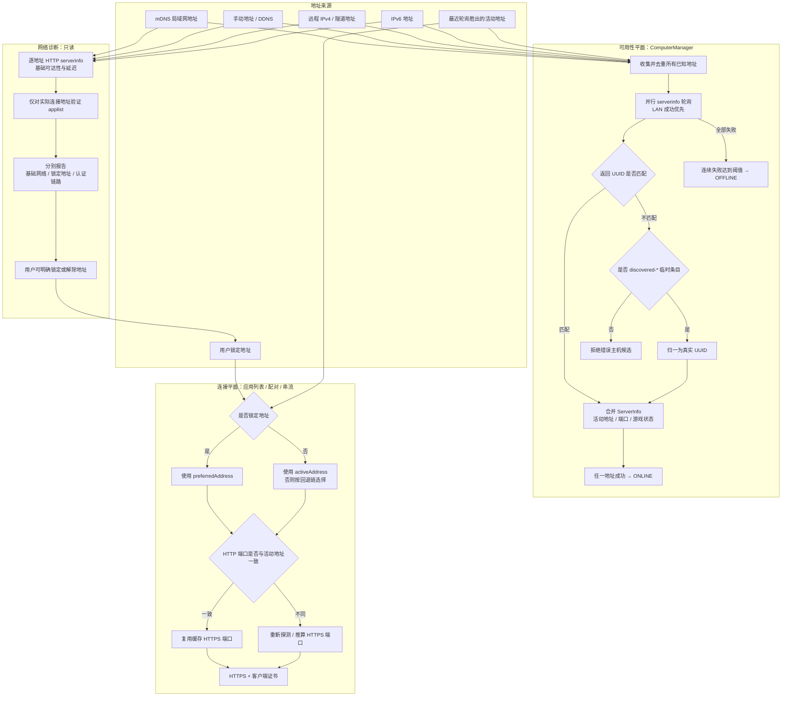

# Moonlight Harmony 网络模型

本模型把“主机是否可达”和“用户实际选择哪条链路连接”拆成两个平面。电脑卡片状态表示任一已知地址能否通过主机身份验证；应用列表、配对和串流则始终遵循用户锁定地址或最近一次轮询胜出的活动地址。

## 不变量

- 网络诊断不修改电脑的在线状态、活动地址、游戏状态或缓存端口。
- 锁定地址只决定实际控制连接，不缩小电脑状态轮询的地址集合。
- 已有真实 UUID 的电脑不会因为某个地址返回其他 UUID 而被重命名或合并。
- 缺少 UUID 的响应和已删除条目返回的陈旧轮询结果不会进入合并路径。
- 只有 `discovered-*` 临时条目可以在首次验证后归一为服务器返回的真实 UUID。
- 缓存 HTTPS 端口仅在目标 HTTP 端口与活动地址端口一致时复用，保持与 Sunshine 端口偏移及 Android Moonlight 一致。
