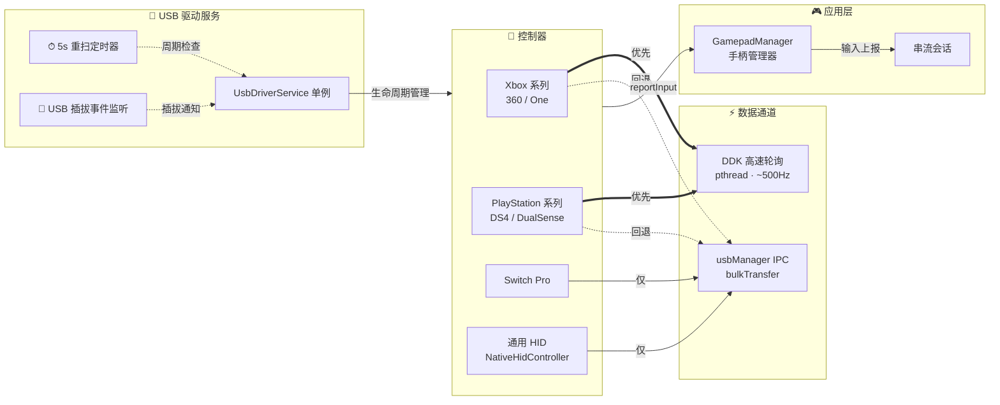
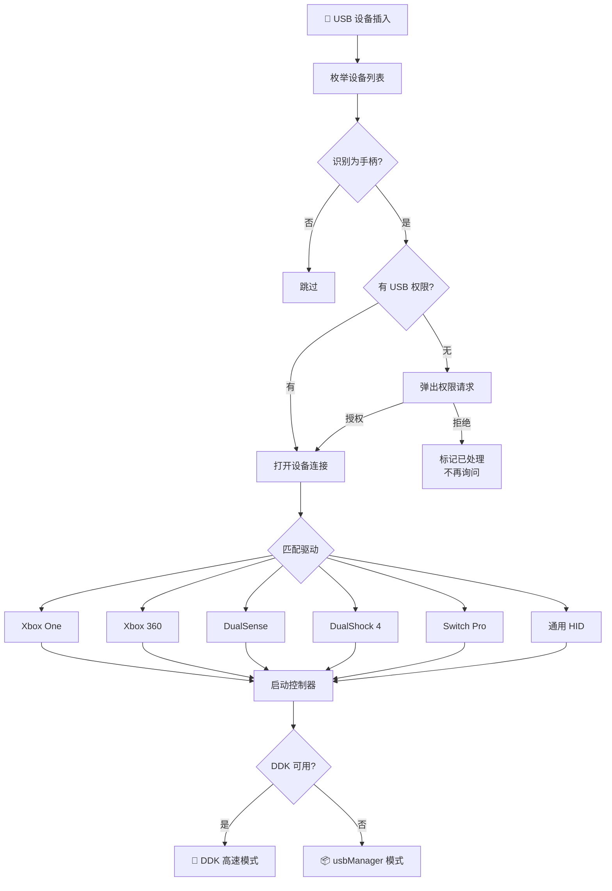
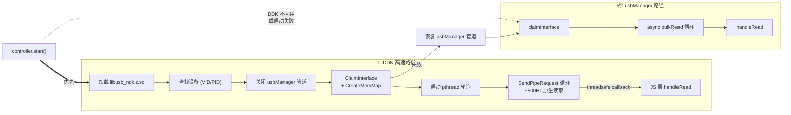
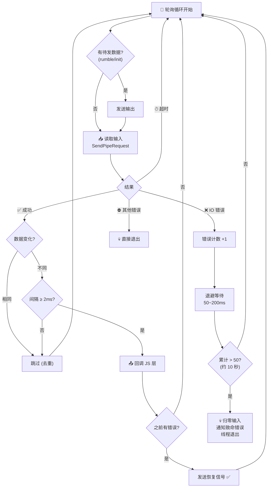
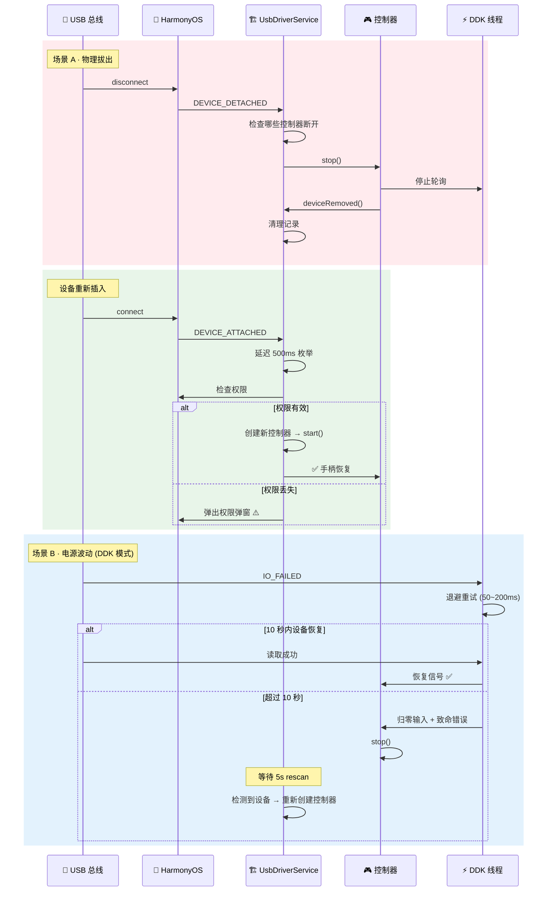
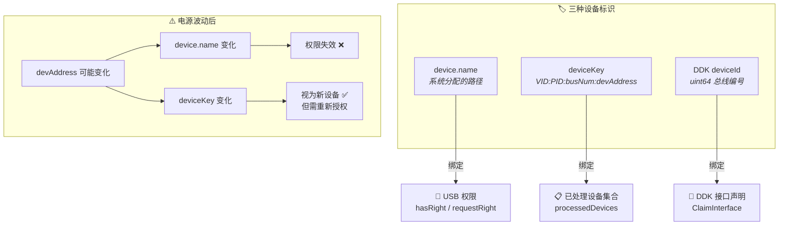
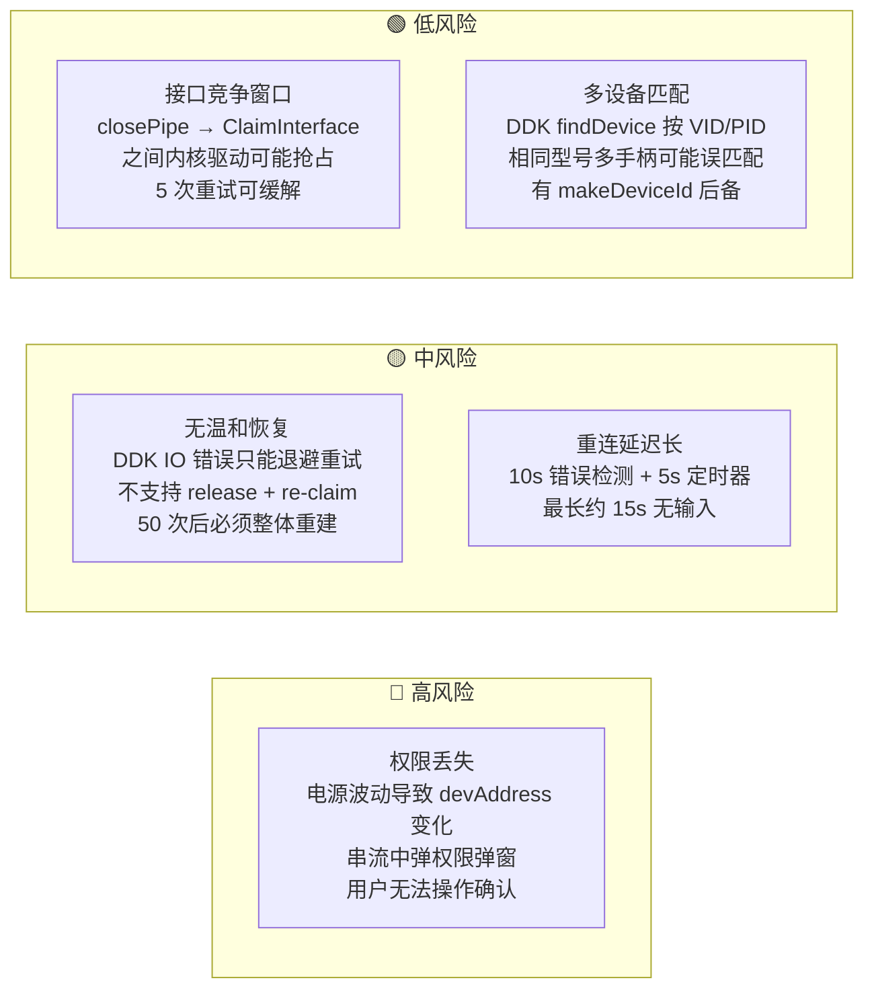

# USB 手柄处理架构

## 系统总览

## 设备发现与驱动选择

## DDK vs usbManager 双路径

## DDK 轮询线程状态机

## 断开与重连时序

## 设备标识与权限模型

## 已知限制与脆弱点

## 文件清单

| 文件 | 职责 |
|------|------|
| `UsbDriverService.ets` | 单例服务：设备枚举、权限、生命周期、5s rescan |
| `AbstractController.ets` | 控制器基类：状态机、输入状态、reportInput |
| `AbstractXboxController.ets` | Xbox 协议基类：DDK/usbManager 双路径、输入循环 |
| `AbstractDualSenseController.ets` | DualSense 协议基类：触摸板、陀螺仪 |
| `Xbox360Controller.ets` | Xbox 360 协议解析 |
| `XboxOneController.ets` | Xbox One 协议解析 |
| `DualSenseController.ets` | PS5 DualSense 协议 |
| `Dualshock4Controller.ets` | PS4 DS4 协议 |
| `SwitchProController.ets` | Switch Pro 协议 |
| `NativeHidController.ets` | 通用 HID：C++ 原生解析器 |
| `DdkUsbPoller.ets` | DDK 封装：NAPI 桥接层 |
| `usb_ddk_poller.cpp` | DDK 原生层：pthread 轮询、memMap、错误恢复 |
| `ControllerConstants.ets` | 常量：按钮标志、控制器类型 |
| `UsbErrorCodes.ets` | USB 错误码映射 |
