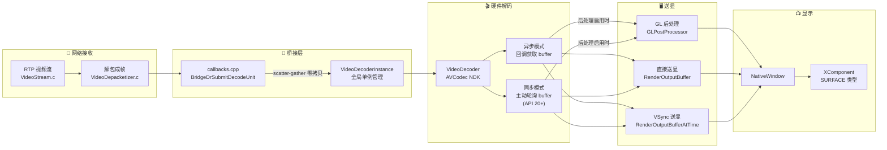
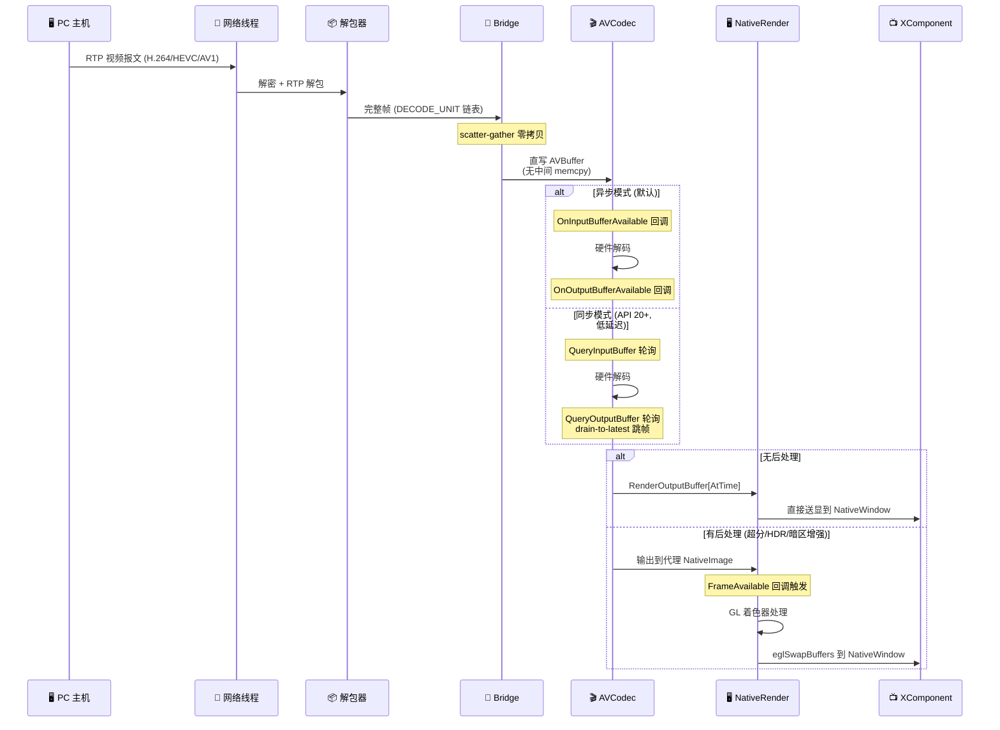
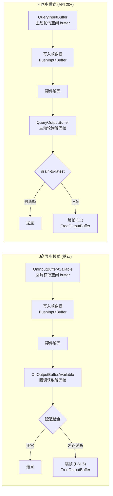
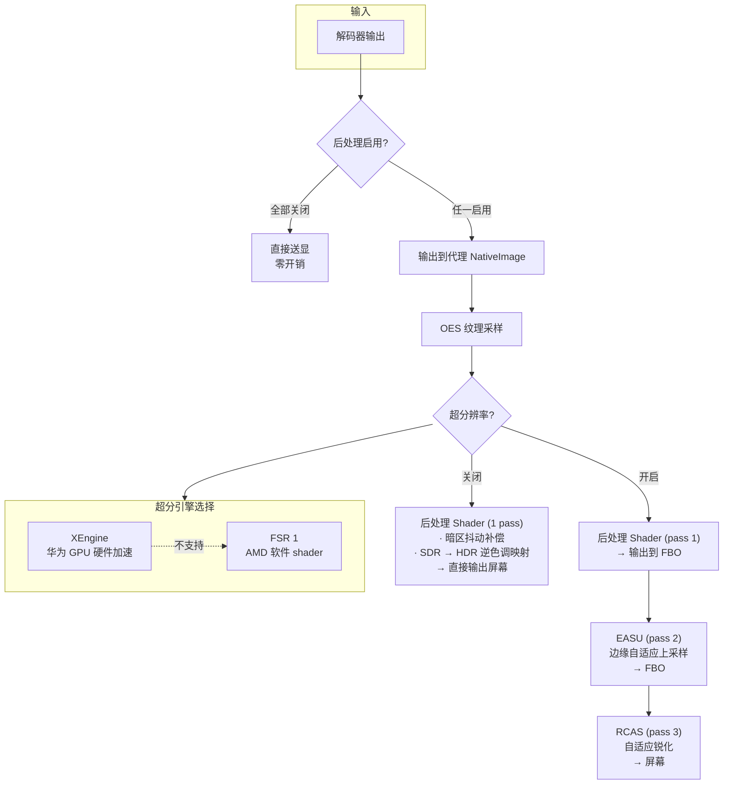
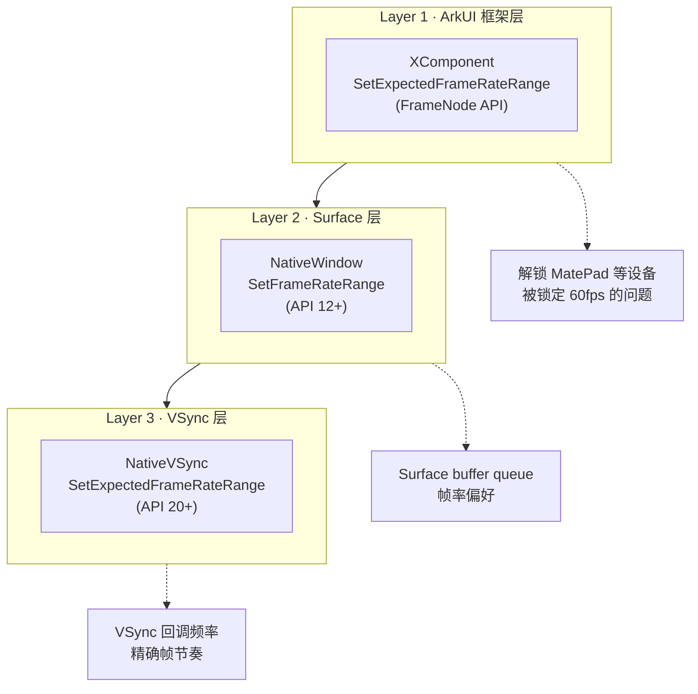
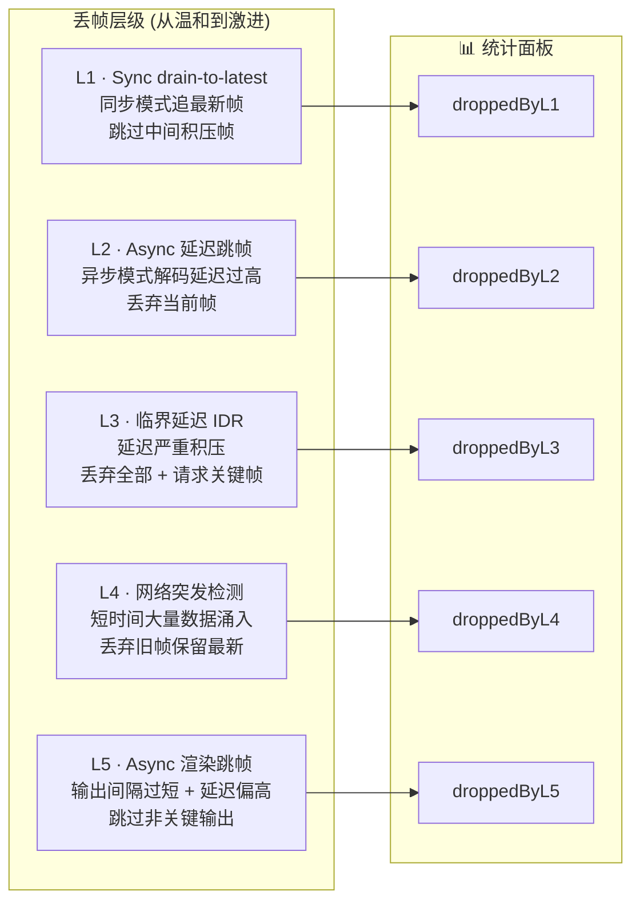

# 视频解码送显架构

## 系统总览

## 数据流转全链路

## 解码器双模式

## GL 后处理管线

## 帧率优化三层机制

## 丢帧分级机制

## 性能优化技术

```mermaid
graph TB
    subgraph CPU ["🔧 CPU 优化"]
        BIG["大核绑定<br/>sched_setaffinity<br/>检测 big.LITTLE 架构"]
        QOS["QoS 最高等级<br/>QOS_USER_INTERACTIVE"]
        BIG --- QOS
    end

    subgraph MEM ["📦 内存优化"]
        SG["Scatter-Gather 零拷贝<br/>网络链表 → 直写 AVBuffer<br/>无中间 memcpy"]
        STACK["栈上分段数组<br/>避免 new/delete GC 压力"]
        SG --- STACK
    end

    subgraph API ["🔌 API 兼容"]
        DLSYM["dlsym 动态加载<br/>同步 API / VRR / VSync"]
        FALLBACK["多级回退<br/>Sync → Async<br/>XEngine → FSR1 → 直通"]
        DLSYM --- FALLBACK
    end

    subgraph DEDUP ["🎯 去重/限流"]
        NOCB["移除无用 JS 回调<br/>每帧 new/delete 消除"]
        DEDUP2["输入去重<br/>同步模式 drain-to-latest"]
        NOCB --- DEDUP2
    end
```

## 文件清单

| 文件 | 层级 | 职责 |
|------|------|------|
| `VideoStream.c` | 网络 | RTP 视频流接收 |
| `VideoDepacketizer.c` | 网络 | RTP 解包、帧重组 |
| `callbacks.cpp` | 桥接 | moonlight-common-c 回调实现 |
| `moonlight_bridge.cpp` | 桥接 | NAPI 接口、Surface 绑定 |
| `video_decoder.h/cpp` | 解码 | AVCodec 解码器：双模式、丢帧、统计 |
| `native_render.h/cpp` | 送显 | NativeWindow 管理、VSync、帧率优化 |
| `gl_post_processor.h/cpp` | 后处理 | EGL/GLES3 着色器：暗区增强、SDR→HDR、超分 |
| `StreamPage.ets` | UI | XComponent 容器、Surface 创建 |
