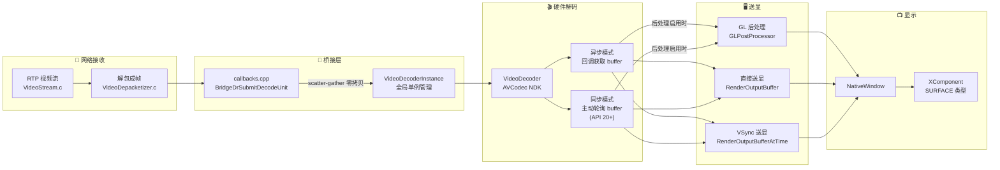
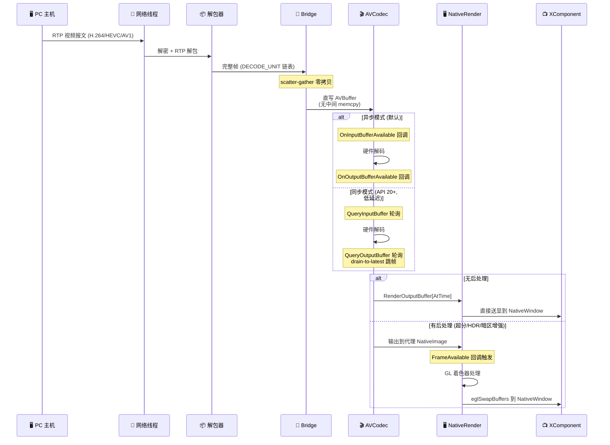
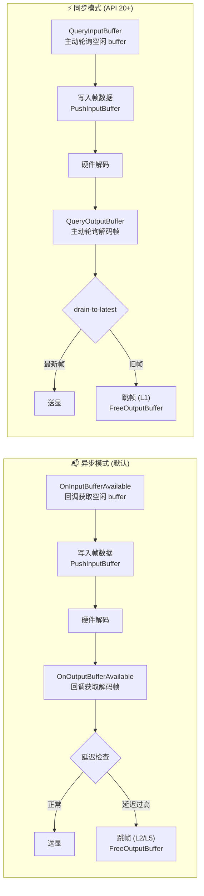
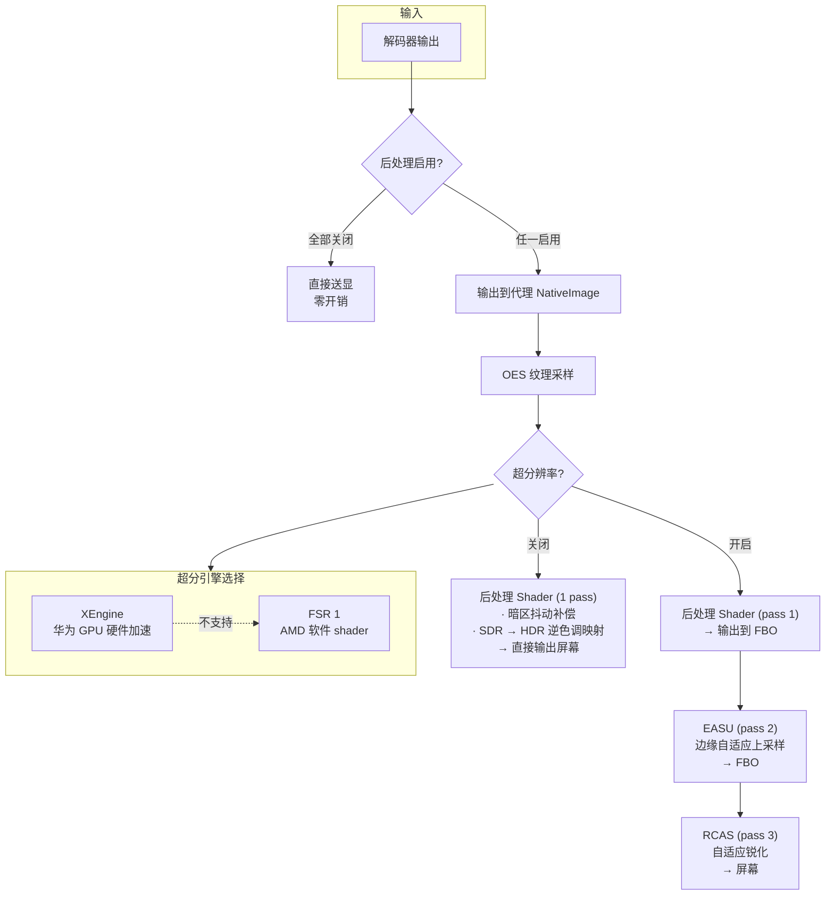
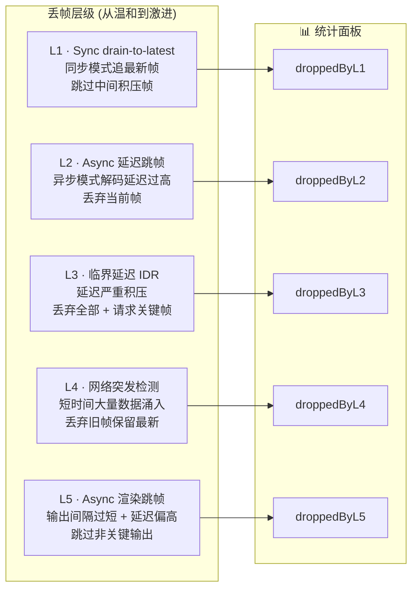

# 视频解码送显架构

## 系统总览

## 数据流转全链路

## 解码器双模式

## GL 后处理管线

## 高帧率请求与诊断

帧率请求是系统决策的输入，不保证屏幕锁定在目标刷新率。OpenHarmony 的
HgmEnergyConsumptionPolicy 可以按设备配置限制无触摸时的 display_soloist、
display_sync 和 ace_component 请求。接口成功不等于实际显示达到目标 Hz。

- 设置页优先读取 API 20+ 的 supportedRefreshRates。列表未知时保留标准档位和
  自定义输入，不能将 refreshRate（当前档位）作为硬件上限。
- 串流 FPS 保留原值供 PTS 调度使用；显示请求选择支持的档位，独立传递给
  XComponent/DisplaySync 和 DisplaySoloist。范围使用 min=0、max=expected，
  不将 90Hz 设备的 max 写成 120。能力未知时尝试用户目标，失败则记录，不视为支持证明。
- XComponent 只使用完整的 NodeHandle 设置/注册/注销路径。旧构造方式或旧系统
  不支持时，回退到公开的 DisplaySync setExpectedFrameRateRange + on('frame') + start。
  start 通过页面 UIContext.runScopedTask 绑定窗口，避免异步调用丢失上下文。
  不通过 GetNativeXComponent 探测并混用另一套接口；串流 DisplaySync 已存在时复用
  其 UI 帧请求，不再另开鼠标 DisplaySync。
- DisplaySoloist 的公开参数上限为 120。仅在 Surface 存在、请求启用且
  60 < 显示目标 <= 120 时运行；更高显示目标由 ArkUI 请求，不能宣称 Soloist 支持 144Hz。
  使用 SDK 类型声明和运行时符号检测。每 2 秒检查失败重试和诊断；运行中的相同
  range 不重复提交。不使用私有 NativeWindow 控帧 API。
- 串流结束、启动失败、页面销毁时清理 DisplaySync、诊断定时器、XComponent 回调
  和 DisplaySoloist；Surface 清除时停止 Soloist，重新绑定后按请求状态恢复。

### 真机验收

编译通过不能替代以下真机验证。用同一主机连续输出运动画面，保持配置相同，
分别测试智能/高刷新率、无触摸至少 60 秒、触摸恢复、菜单返回，以及重连和退出。
覆盖 120fps、144fps、119.88fps，支持列表缺失的旧 API 设备，以及 120Hz 屏在
当前 60/90Hz 时打开设置的情况。

搜索 hilog 的 FrameRateDiagnostics 和 XCFrameRate：

- ArkTS 每 5 秒输出当前 screenHz、显示目标、请求路径、DisplaySync 回调频率，
  并附接收 FPS、提交统计、解码延迟和丢帧数。
- Native 在解码帧到达时约每 6 秒输出 Soloist 回调频率和 SubmitFrame 调用率。
  它不是独立看门狗：没有解码输出时不会打印；ArkTS 定时器仍可报告。
- XComponent 有实际回调时约每 5 秒输出回调频率。
- callbackHz、提交 FPS 和物理上屏 FPS 是不同指标。结合系统刷新率叠加层和
  RenderService trace 验证；提交成功不代表该帧已经显示。
- 退出后应不再有本次串流的回调与诊断，重新进入应能重新注册。
- 需要另测锁屏、后台音频、多窗口和画中画；当前清理以串流/页面/Surface 生命周期为准，
  尚不能据此宣称覆盖全部窗口可见性切换或所有设备的节能策略。

机制参考：[OpenHarmony 节能策略](https://github.com/openharmony/graphic_graphic_2d/blob/OpenHarmony-6.0-Release/rosen/modules/hyper_graphic_manager/core/frame_rate_manager/hgm_energy_consumption_policy.cpp)。

接口约束参考：[DisplaySync 启动上下文](https://github.com/openharmony/docs/blob/master/zh-cn/application-dev/reference/apis-arkgraphics2d/js-apis-graphics-displaySync.md#start)、
[Soloist 0–120 参数范围](https://github.com/openharmony/docs/blob/master/zh-cn/application-dev/reference/apis-arkgraphics2d/capi-nativedisplaysoloist-displaysoloist-expectedraterange.md)。
深入复核见 `docs/HIGH_REFRESH_RATE_REVIEW_2026-09-15.md`。

回归测试：用 C++17 编译运行 `nativelib/src/test/cpp/frame_rate_request_test.cpp`
（include 路径为 `nativelib/src/main/cpp`），以及
`node scripts/test-display-frame-rate.cjs <SDK 的 typescript/lib/typescript.js 路径>`。
覆盖 Soloist 拒绝超过 120Hz、ArkUI 144Hz 目标、分数帧率、无效输入、90Hz 设备、
当前档位低于硬件上限与能力列表缺失。UIContext 和物理刷新率效果仍需真机验证。

## 丢帧分级机制

## 性能优化技术

```mermaid
graph TB
    subgraph CPU ["🔧 CPU 优化"]
        BIG["大核绑定<br/>sched_setaffinity<br/>检测 big.LITTLE 架构"]
        QOS["QoS 最高等级<br/>QOS_USER_INTERACTIVE"]
        BIG --- QOS
    end

    subgraph MEM ["📦 内存优化"]
        SG["Scatter-Gather 零拷贝<br/>网络链表 → 直写 AVBuffer<br/>无中间 memcpy"]
        STACK["栈上分段数组<br/>避免 new/delete GC 压力"]
        SG --- STACK
    end

    subgraph API ["🔌 API 兼容"]
        DLSYM["dlsym 动态加载<br/>同步 API / VRR / VSync"]
        FALLBACK["多级回退<br/>Sync → Async<br/>XEngine → FSR1 → 直通"]
        DLSYM --- FALLBACK
    end

    subgraph DEDUP ["🎯 去重/限流"]
        NOCB["移除无用 JS 回调<br/>每帧 new/delete 消除"]
        DEDUP2["输入去重<br/>同步模式 drain-to-latest"]
        NOCB --- DEDUP2
    end
```

## 文件清单

| 文件 | 层级 | 职责 |
|------|------|------|
| `VideoStream.c` | 网络 | RTP 视频流接收 |
| `VideoDepacketizer.c` | 网络 | RTP 解包、帧重组 |
| `callbacks.cpp` | 桥接 | moonlight-common-c 回调实现 |
| `moonlight_bridge.cpp` | 桥接 | NAPI 接口、Surface 绑定 |
| `video_decoder.h/cpp` | 解码 | AVCodec 解码器：双模式、丢帧、统计 |
| `native_render.h/cpp` | 送显 | NativeWindow 管理、VSync、帧率优化 |
| `gl_post_processor.h/cpp` | 后处理 | EGL/GLES3 着色器：暗区增强、SDR→HDR、超分 |
| `StreamPage.ets` | UI | XComponent 容器、Surface 创建 |
